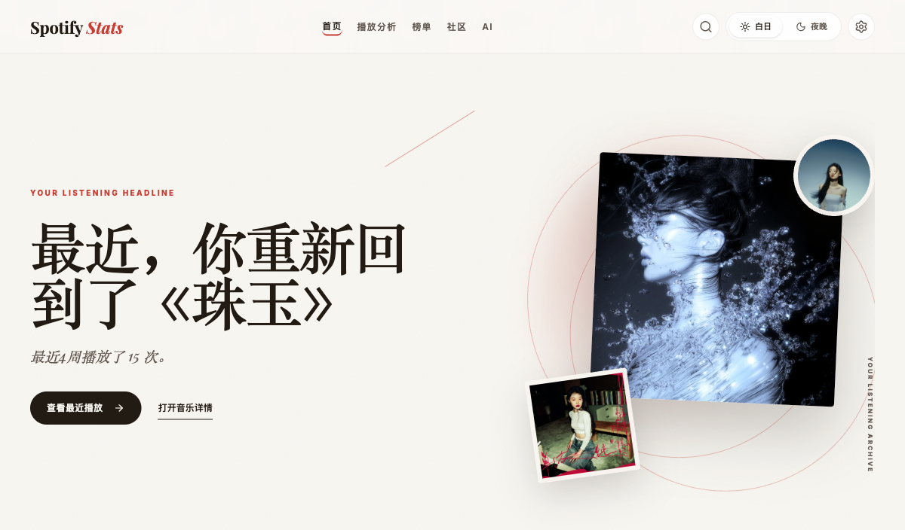
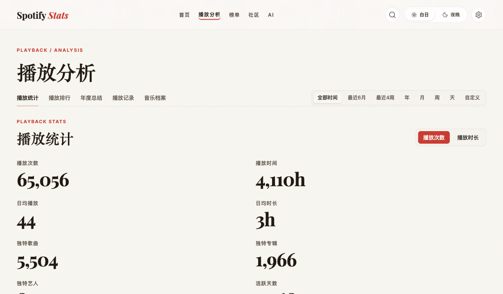
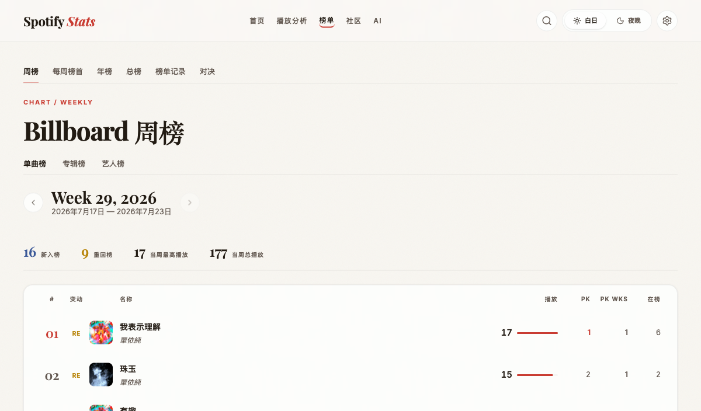
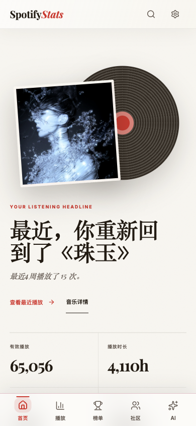

<div align="center">

# SpotifyStats

### 本地优先的个人音乐档案与听歌分析工作台

将 Spotify 官方导出的播放记录和账号数据，转化为可以持续探索的个人音乐头版、播放统计、年度总结、个人 Billboard 榜单和音乐实体档案。

<p>
  <a href="#快速开始">快速开始</a> ·
  <a href="#你可以用它做什么">功能亮点</a> ·
  <a href="docs/README.md">文档地图</a> ·
  <a href="deploy/production/README.md">部署指南</a>
</p>

[](https://github.com/BenjaminTay/SpotifyStats/actions/workflows/ci-quality.yml)
[](requirements.txt)
[](frontend/package.json)
[](LICENSE)

</div>

<p align="center">
  
</p>

<p align="center">
  <em>把“我听过什么”，整理成一份可以回看的个人音乐档案。</em>
</p>

> [!NOTE]
> README 中的页面截图使用本地演示数据，包含用于展示界面效果的播放次数、歌曲名称、封面和榜单内容；截图仅用于展示产品形态与统计能力，不代表项目提供公共在线 Demo。SpotifyStats 是本地优先的单用户个人工具，播放历史、账号导出、SQLite 数据库和封面缓存默认保存在自己的设备上。

## 你可以用它做什么

| 方向 | 能看到什么 |
| --- | --- |
| **个人音乐头版** | 每日听歌头条、最近 4 周、旧爱重听（刷新首页可随机重逢一首）、音乐档案和年度入口；Desktop 与 Phone 各自适配阅读节奏。 |
| **播放分析** | 播放趋势、听歌时段、歌曲 / 专辑 / 艺人排行、播放记录和时间分布。 |
| **个人 Billboard** | 歌曲、专辑、艺人周榜与年榜、走势总榜、榜单记录、对决和发行周期分析。 |
| **年度总结** | 自有八章年度总结，包含年度事实、时间线、精选纪录和完整榜单。 |
| **音乐档案** | 收藏歌曲、专辑、艺人、歌单、搜索历史、播客和视频等账号数据分析。 |
| **音乐详情** | 从歌曲、专辑或艺人深链进入播放统计与榜单成绩；专辑、艺人的成员成绩按需加载。 |
| **可选 AI 洞察** | 缓存优先的周报、月报、年度叙事和只读自然语言问答；需要自行配置 LLM。 |

## 典型使用流程

```text
Spotify 数据导出
      ↓
导入前检查与数据健康报告
      ↓
本地 SQLite + 可复核的统计事实
      ↓
个人音乐头版 / 播放分析 / 年度总结 / 个人 Billboard
```

## 产品画廊

首页负责把听歌数据整理成一张可阅读的个人头版；播放统计负责回答“听了多少、何时在听、趋势如何”；个人 Billboard 则把长期变化变成可以持续追踪的榜单。

<table>
  <tr>
    <td width="50%" valign="top">
      
      <p align="center"><strong>播放统计</strong><br><sub>播放次数、播放时长、听歌趋势、时间分布与播放记录</sub></p>
    </td>
    <td width="50%" valign="top">
      
      <p align="center"><strong>个人 Billboard 周榜</strong><br><sub>榜单周切换、排名变化、PK Wks、入榜与重回榜</sub></p>
    </td>
  </tr>
</table>

## 快速开始

### 环境要求

- Python 3.9+
- Node.js 22+
- Chromium、Firefox 或 WebKit 浏览器

### 1. 获取 Spotify 数据

从 [Spotify 隐私设置](https://www.spotify.com/account/privacy/) 请求 **Extended Streaming History** 和 **Account Data**。下载并解压后，将数据放入：

```text
data/
├── streaming/    # Streaming_History_Audio_*.json
└── account/      # Wrapped、YourLibrary、Playlist、SearchQueries 等 JSON
```

文件清单和字段说明见 [`data/README.md`](data/README.md)。真实导出文件属于个人数据，请勿提交到 GitHub。

### 2. 安装依赖

```bash
python3 -m venv .venv
source .venv/bin/activate
pip install -r requirements.txt

cd frontend
npm ci --legacy-peer-deps
cd ..
```

### 3. 启动开发环境

在两个终端分别运行：

```bash
# 终端一：后端 API
source .venv/bin/activate
uvicorn backend.main:app --reload --reload-dir backend
```

```bash
# 终端二：前端
cd frontend
npm run dev
```

然后访问：

- 前端：<http://localhost:5173>
- API 文档：<http://localhost:8000/docs>

首次启动只会创建或迁移 SQLite，不会自动导入个人 JSON。打开前端后，进入「设置 → 数据导入」，先运行只读的「导入前检查」，再手动导入 Streaming History 和 Account Data；完成后可在同一区域查看数据健康报告。详细规则见 [`docs/reference/data-import-and-health.md`](docs/reference/data-import-and-health.md)。

### 查看移动端效果

Phone presentation 使用独立的移动网页布局，主要触控目标至少为 44×44px；数据导入、元数据治理、凭据和系统维护仍建议在桌面端完成。可以使用 390×844 响应式视口快速查看：

```bash
node scripts/frontend_route_smoke.mjs \
  --base-url http://localhost:5173 \
  --api-base-url http://127.0.0.1:8000 \
  --viewport matrix \
  --max-scroll-overflow 0 \
  --fail-on-console-warning
```

## 移动端与部署

<p align="center">
  
</p>

- `<768px` 使用 Phone presentation，`768–1023px` 为 Compact，`>=1024px` 使用 Desktop。
- 三种 presentation 共享路由、Query、过滤指纹和统计事实，但宽表、重图表和长列表不同时挂载。
- 本地 Docker：

  ```bash
  docker compose build
  docker compose up -d
  ```

- 长期运行可使用 [`deploy/production/README.md`](deploy/production/README.md) 中的双运行面配置。外部 HTTPS、Tailscale 或域名代理属于可选部署层，生产脚本不会自动启用或关闭它们。
- 生产环境的完整入口、备份、回滚、只读展示面和安全边界，以部署文档为准；不要直接将 3000、3001、3002 或 8000 暴露到公网。

## 隐私与项目边界

- 播放历史、账号导出、SQLite、封面和运行时缓存默认只保存在本地。
- `data/`、备份目录和环境密钥不会进入 Git 或 Docker 镜像。
- AI 是可选能力；基础导入、统计、榜单和年度事实不依赖 LLM。
- 公共展示模式（如果自行启用）只开放批准的只读能力，不等于整站身份认证。
- Spotify OAuth、部分百科 / 歌词增强和 LLM 能力可能需要额外配置，并应遵守对应服务的条款。

## 开发与测试

```bash
# 后端单元测试与契约测试
source .venv/bin/activate
pytest -m unit -q
pytest -m contract -q

# 前端测试与生产构建
cd frontend
npm test
npm run build
```

文档、架构边界和 CI 验证矩阵见 [`CLAUDE.md`](CLAUDE.md)。

## 技术栈

| 层 | 技术 |
| --- | --- |
| 后端 | FastAPI、Pandas、SQLite、Pydantic、pytest、Ruff、Mypy |
| 前端 | React、TypeScript、Vite、Tailwind CSS、React Router、TanStack React Query、ECharts、Vitest |
| 数据与运行时 | SQLite WAL、版本化 Migration、OAuth PKCE、后台任务队列、缓存管理、GitHub Actions |

## 项目结构

```text
SpotifyStats/
├── backend/          # FastAPI API、业务服务和领域逻辑
├── frontend/         # React 页面、组件、Hooks 和 API 类型
├── data/             # 本地 JSON 输入、SQLite 数据库和运行时缓存
├── scripts/          # 导入、维护、验证和性能检查脚本
├── deploy/           # 本地与生产部署配置
├── docs/             # 规则、架构、计划、报告和历史归档
└── requirements.txt
```

## 从哪里继续阅读

| 你想了解 | 入口 |
| --- | --- |
| 准备 Spotify JSON 和导入数据 | [`data/README.md`](data/README.md) |
| 查看当前文档地图 | [`docs/README.md`](docs/README.md) |
| 理解播放统计口径 | [`docs/reference/playback-stats-rules.md`](docs/reference/playback-stats-rules.md) |
| 理解音乐档案统计 | [`docs/reference/account-archive-statistics.md`](docs/reference/account-archive-statistics.md) |
| 处理版本、署名、艺人和流派语言 | [`docs/reference/music-metadata-management.md`](docs/reference/music-metadata-management.md) |
| 前端开发和页面约束 | [`frontend/README.md`](frontend/README.md) / [`frontend/UI_STYLE_GUIDE.md`](frontend/UI_STYLE_GUIDE.md) |
| 查看交付证据和当前状态 | [`docs/reports/README.md`](docs/reports/README.md) |
| 查看变更历史 | [`docs/CHANGELOG.md`](docs/CHANGELOG.md) |

## License

[MIT](LICENSE)

SpotifyStats is not affiliated with or endorsed by Spotify.
