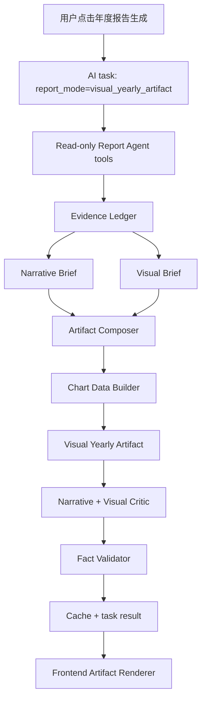

# AI Visual Yearly Report Artifact Design

> 创建日期：2026-07-03
> 状态：设计稿，待人工确认后进入 implementation plan
> 相关模块：`backend/services/yearly_report_agent_service.py`、`backend/domains/ai_reports/`、`backend/services/ai_task_service.py`、`frontend/src/features/ai-insights/`、`frontend/src/features/ai-tasks/`

## 1. 背景

当前年度报告已经从早期的短摘要升级到 `agentic_longform`：后端 Report Agent 会用只读工具查询年度概览、TOP 实体、同期对比、个人 Billboard 年榜、Billboard 诊断、流派、发现回归和高光日，再生成 evidence ledger、insight synthesis、dynamic outline、长文草稿，并经过 editorial critic 与 fact validation。

这解决了三个底层问题：

- 数据不是一次性塞给 LLM，而是通过只读工具分步获取。
- 生成过程有 task events、tool calls 和 metadata，用户不再空等。
- 年中/全年、个人榜单边界、事实校验和 fallback 语义比以前更安全。

但当前交付形态仍然失败：它输出的是一段 Markdown 文本，而且文风像商业分析报告。实际用户看到的是一串数据摘要、内部术语和硬邦邦的小标题，而不是一份值得阅读、保存、回看的个人音乐年报。

本 spec 的目标是把年度报告从 **AI 数据摘要** 升级为 **AI 图文音乐年报 Artifact**。

## 2. 问题诊断

以当前 2025 报告为例：

```text
Taylor Swift 是稳定中心，Michael Wong 贡献另一条主线，JOLIN 是今年最清晰的新发现入口。
概览
364 个活跃日内，你播放 17,567 次，累计 1135 小时...
```

主要问题：

1. **太短**：几百字无法承载完整年度回望。
2. **太干**：只有文字，没有图表、视觉锚点、重点卡片或年度节奏感。
3. **像商业报告**：使用“稳定中心”“主线”“入口”“个人 Billboard 年榜”等内部分析词。
4. **缺少故事感**：没有把音乐和用户的生活节奏、个性、陪伴关系联系起来。
5. **缺少解释**：播放量第一专辑和个人榜第一专辑不同，这是有趣的矛盾，但现在只并列罗列。
6. **缺少画面**：高光日、年度热力、艺人月度趋势、新发现时间线都适合可视化，但目前没有呈现。
7. **不够像年报**：最终交付不像 Wrapped、年记或个人档案，更像 API response 的自然语言版本。

## 3. 产品目标

正式年度报告应该是一份“有数据可信度的个人音乐年报”：

- 像一篇文章：有开头、主线、转折、章节推进和收束。
- 像一份年报：有图表、关键数字、视觉节奏和重点卡片。
- 像写给用户本人：能分析音乐如何陪伴生活、反映性格、构成记忆。
- 像可信的数据产品：所有数字、排行、图表都来自后端真实数据，不由 LLM 编造。

### 成功标准

完整年度报告：

- 正文总量约 2800-4500 中文字符。
- 至少 6 个 narrative sections。
- 至少 4 个 chart blocks。
- 至少 3 个 insight cards。
- 至少 1 个“播放量 vs 个人榜单”矛盾或互证分析。
- 至少 1 个“生活节奏”分析。
- 至少 1 个“陪伴感/长期关系”分析。
- 至少 1 个“新发现/口味变化”分析。

年中报告：

- 正文总量约 1800-3200 中文字符。
- 标题和正文必须明确“截至数据截止日”。
- 不使用“全年冠军”“年度最终”等完整年度结论。
- 结尾写“下阶段观察”，而不是完整年度盖棺定论。

所有报告：

- 不把内部术语直接暴露给用户。
- 不编造具体生活事件、天气、失眠、分手、考试、旅行等没有数据支持的场景。
- 可以使用克制推测，例如“像是”“更像”“也许”“这更接近于”。
- 图表数据必须由后端只读工具或确定性 chart data builder 生成。

## 4. 非目标

本轮不做：

- PDF/长图导出。
- 社交分享海报。
- 用户自定义主题。
- LLM 自己生成图片。
- 任意 SQL、任意 URL 或外部官方 Billboard 查询。
- 取代现有 `/yearly-review` 播放分析年度总结页。

本轮要做的是年度 AI 报告的正式交付层，不是完整的 Wrapped 重做。

## 5. 核心设计

新增 `visual_yearly_artifact` 报告模式。它不再只返回 `report: string`，而是返回结构化 artifact：

```json
{
  "report_mode": "visual_yearly_artifact",
  "contract_version": "visual_yearly_v1",
  "title": "你的 2025 音乐年记",
  "subtitle": "几乎没有离开音乐的一年",
  "period": {
    "year": 2025,
    "start_date": "2025-01-01",
    "end_date": "2025-12-31",
    "is_partial_year": false
  },
  "narrative_brief": {},
  "visual_brief": {},
  "sections": [],
  "insight_cards": [],
  "chart_specs": [],
  "chart_data": {},
  "metadata": {}
}
```

前端优先渲染 `artifact`。如果 task result 没有 artifact，则回退到现有 `ReportCard` Markdown 渲染。

## 6. 数据流



关键原则：

- Report Agent 仍负责查证据。
- Narrative Brief 负责把数据转成故事素材。
- Visual Brief 负责选择图表和视觉模块。
- Artifact Composer 负责生成用户可读的章节文本和 chart refs。
- Chart Data Builder 负责用真实数据填充图表数据。
- Critic/Validator 负责阻止商业报告腔、术语泄漏、图表缺失和事实错误。

## 7. Narrative Brief

新增结构化 `NarrativeBrief`，它是最终文章的故事底稿。

示例：

```json
{
  "main_story": "2025 是稳定陪伴与华语情绪线并行的一年。",
  "opening_scene": "你几乎每天都在听音乐，音乐不是偶尔打开的背景，而是全年生活的一部分。",
  "companionship_thread": {
    "entity": "Taylor Swift",
    "interpretation": "她像一个反复回到的稳定房间。",
    "evidence_refs": ["top_artist_1", "artist_year_end_1"]
  },
  "second_thread": {
    "entity": "Michael Wong",
    "interpretation": "他提供了更怀旧、更现场感的华语情绪线。",
    "evidence_refs": ["top_artist_2", "genre_mandopop"]
  },
  "discovery_thread": {
    "entity": "JOLIN",
    "interpretation": "她是新入口，但还不是全年主线。",
    "confidence": "medium",
    "evidence_refs": ["new_artist_1"]
  },
  "tensions": [
    {
      "title": "最常播放的专辑和最稳定在榜的专辑不是同一张",
      "interpretation": "这说明重复聆听和持续影响力不是同一种偏爱。"
    }
  ],
  "life_rhythm": {
    "interpretation": "364 个活跃日说明音乐几乎贯穿全年。",
    "tone": "companionate"
  },
  "safe_speculation_rules": [
    "可以写像陪伴、回到、节奏、出口",
    "不能编造具体事件",
    "生活推断必须用克制语气"
  ]
}
```

Narrative Brief 的作用：

- 把“数据字段”变成“故事素材”。
- 限制最终作者不要直接复述排行榜。
- 给风格 critic 提供可检查的故事义务。

## 8. Visual Brief

新增结构化 `VisualBrief`，由 Agent 根据证据选择图表。

示例：

```json
{
  "visual_thesis": "这一年最适合用全年陪伴密度、双主线艺人趋势、专辑偏爱差异和新发现时间线来呈现。",
  "required_chart_ids": [
    "listening_calendar",
    "artist_monthly_trend",
    "album_duality_compare",
    "highlight_day_timeline"
  ],
  "optional_chart_ids": [
    "genre_mix",
    "discovery_timeline",
    "playback_billboard_matrix"
  ],
  "chart_order_reasoning": [
    "先展示音乐铺满全年",
    "再展示核心艺人的时间变化",
    "再解释播放量和个人榜单的差异",
    "最后用高光日和新发现增加记忆点"
  ]
}
```

Visual Brief 不包含实际图表数据，只包含图表选择、叙事意图和排序。

## 9. Artifact Schema

### `VisualYearlyArtifact`

```python
@dataclass(frozen=True)
class VisualYearlyArtifact:
    report_mode: str
    contract_version: str
    title: str
    subtitle: str
    period: dict[str, Any]
    narrative_brief: dict[str, Any]
    visual_brief: dict[str, Any]
    sections: tuple[YearlyArtifactSection, ...]
    insight_cards: tuple[YearlyInsightCard, ...]
    chart_specs: tuple[YearlyChartSpec, ...]
    chart_data: dict[str, Any]
    metadata: dict[str, Any]
```

### `YearlyArtifactSection`

```json
{
  "id": "opening",
  "role": "opening",
  "heading": "几乎没有离开音乐的一年",
  "deck": "364 个活跃日不是一个普通数字，它意味着音乐几乎每天都在场。",
  "prose": "这一年，你不是偶尔想起音乐...",
  "chart_refs": ["listening_calendar"],
  "insight_refs": ["activity_density"],
  "evidence_refs": ["yearly_overview"],
  "pull_quote": "音乐不是偶尔打开的背景，而是全年生活的一部分。"
}
```

Section roles：

- `opening`
- `year_rhythm`
- `companionship`
- `second_thread`
- `album_story`
- `personal_chart_story`
- `genre_identity`
- `discovery`
- `highlight_day`
- `closing`

### `YearlyInsightCard`

```json
{
  "id": "activity_density",
  "label": "全年陪伴密度",
  "value": "364 天",
  "caption": "这一年几乎每天都有音乐在场。",
  "tone": "warm",
  "evidence_refs": ["yearly_overview"]
}
```

### `YearlyChartSpec`

```json
{
  "id": "artist_monthly_trend",
  "chart_type": "artist_monthly_trend",
  "title": "Taylor Swift 与 Michael Wong 的双主线",
  "narrative_question": "哪条声音陪你走得最久，哪条声音在特定月份更突出？",
  "entities": ["Taylor Swift", "Michael Wong"],
  "data_key": "artist_monthly_trend",
  "insight": "Taylor Swift 是稳定底色，Michael Wong 提供另一条华语情绪线。",
  "fallback": "如果月度数据不足，改用艺人年度对照卡。"
}
```

## 10. Chart Types

第一版支持 7 类图表，至少渲染其中 4 类。

### 1. `listening_calendar_heatmap`

展示一年中每天的播放强度。

数据：

```json
{
  "days": [
    {"date": "2025-01-01", "plays": 42, "minutes": 180}
  ],
  "active_days": 364,
  "max_day": {"date": "2025-02-14", "plays": 154}
}
```

叙事用途：

- 展示音乐是否贯穿全年。
- 支撑生活节奏和陪伴密度分析。

### 2. `artist_monthly_trend`

展示 2-4 位核心艺人按月播放变化。

数据：

```json
{
  "entities": ["Taylor Swift", "Michael Wong"],
  "months": [
    {"month": "2025-01", "Taylor Swift": 210, "Michael Wong": 96}
  ]
}
```

叙事用途：

- 展示“稳定陪伴”和“第二主线”是否全年持续。
- 避免只看全年总播放导致结论扁平。

### 3. `album_duality_compare`

对照播放量第一专辑和个人榜单第一专辑。

数据：

```json
{
  "playback_leader": {
    "name": "The Life of a Showgirl",
    "artist": "Taylor Swift",
    "plays": 1106
  },
  "chart_leader": {
    "name": "光良「回憶裡的瘋狂」巡迴演唱會",
    "artist": "Michael Wong",
    "weeks_on_chart": 32
  },
  "interpretation": "播放量和持续在榜衡量的是两种不同偏爱。"
}
```

叙事用途：

- 解释“常听”和“持续影响力”的差异。
- 让个人榜单不再像硬插入的数据段。

### 4. `highlight_day_timeline`

拆解年度最高播放日的小时分布、Top 曲目和集中度。

数据：

```json
{
  "date": "2025-02-14",
  "total_plays": 154,
  "hourly": [{"hour": 9, "plays": 12}],
  "top_tracks": [{"name": "15 Minutes", "artist": "Sabrina Carpenter", "plays": 9}],
  "repeat_concentration": "low"
}
```

叙事用途：

- 把“高光日”从一句数字变成可读记忆点。
- 判断是单曲循环、专辑沉浸还是多曲目漫游。

### 5. `genre_language_mix`

展示流派/语种/地域标签构成。

数据：

```json
{
  "genres": [
    {"name": "mandopop", "share": 16.7},
    {"name": "c-pop", "share": 16.6}
  ],
  "caveat": "Spotify 流派标签可能重叠，百分比不互斥。"
}
```

叙事用途：

- 支撑“音乐地理”和个性画像。
- 避免把流派列表写成干巴巴的百分比。

### 6. `discovery_timeline`

展示新艺人首次出现和后续播放。

数据：

```json
{
  "new_artists": [
    {"name": "JOLIN", "first_seen": "2025-05-08", "plays": 108}
  ]
}
```

叙事用途：

- 区分“短暂路过”和“真正新入口”。
- 给新发现更清晰的证据。

### 7. `playback_billboard_matrix`

二维矩阵：播放量强度 vs 个人榜单稳定性。

数据：

```json
{
  "items": [
    {
      "name": "The Fate of Ophelia",
      "type": "track",
      "plays": 190,
      "weeks_on_chart": 13,
      "peak": 1
    }
  ]
}
```

叙事用途：

- 找出“又常听又稳定”的作品。
- 找出“短期爆发”和“长期陪伴”的差异。

## 11. 用户文案风格

最终正文应该像“个人音乐年记”，不是商业报告。

### 推荐写法

```text
Taylor Swift 不是只在某一首歌里出现，她更像是你这一年反复回到的房间。单曲、专辑和艺人三个层面都在提醒同一件事：你不是偶尔想起她，而是把她放进了日常的很多缝隙里。
```

### 禁止写法

```text
Taylor Swift 是稳定中心，形成艺人、专辑、单曲三榜联动，提供第二层证据。
```

### 术语翻译规则

| 内部术语 | 用户正文替代表达 |
| --- | --- |
| 稳定中心 | 反复回到的声音 / 稳定陪伴 |
| 三榜联动 | 不只是一首歌，而是多层面持续在场 |
| 个人 Billboard | 你的个人榜单 / 持续在榜记录 |
| evidence ledger | 查询到的证据 / 数据线索 |
| dynamic outline | 文章结构 |
| insight synthesis | 这一年的主线 |
| dominance | 占据全年存在感 |
| breakout | 新出现并留下痕迹 |

正文中允许出现“你的个人榜单”，但不应频繁出现“Billboard”。如需解释，放在脚注或信息提示中。

## 12. Critic 与 Validator

新增 `visual_yearly_critic`，和现有 `yearly_validator` 并行。

### Fact Validator 继续负责

- 截止日。
- 年中/全年口径。
- TOP 名称保真。
- 个人榜单不是外部官方 Billboard。
- 不编造生活事件。
- 不错误使用完整年度标签。

### Visual/Narrative Critic 负责

- 正文长度是否达标。
- section 数量是否达标。
- chart_specs 数量是否达标。
- chart_refs 是否都能在 `chart_specs` 和 `chart_data` 中找到。
- 是否出现商业报告腔。
- 是否泄漏内部术语。
- 是否过度罗列数字。
- 是否有陪伴感。
- 是否有生活节奏分析。
- 是否有新发现/口味变化分析。
- 是否分析播放量和个人榜单的关系。

拦截词示例：

```python
BUSINESS_REPORT_TERMS = (
    "稳定中心",
    "主线",
    "入口",
    "第二层证据",
    "三榜联动",
    "维度",
    "指标",
    "综合来看",
    "后续观察",
)
```

注意：这些词可以出现在 internal brief 中，但不能出现在最终用户正文中。

## 13. 后端改动范围

新增模块建议：

```text
backend/domains/ai_reports/
├── visual_artifact_models.py
├── narrative_brief.py
├── visual_brief.py
├── visual_chart_data.py
├── visual_yearly_prompts.py
├── visual_yearly_critic.py
└── visual_yearly_renderer.py
```

### `visual_artifact_models.py`

定义 artifact dataclasses 与 `to_dict()`。

### `narrative_brief.py`

从 evidence/context 生成 Narrative Brief。

第一版可以先用确定性规则生成，再允许 LLM 修饰：

- 从 TOP 艺人判断陪伴主线。
- 从 TOP2/TOP3 艺人判断第二情绪线。
- 从 new artists 判断新发现。
- 从 active days/minutes 判断生活节奏。
- 从 playback leader vs chart leader 判断张力。

### `visual_brief.py`

根据 Narrative Brief 和数据可用性选择图表。

### `visual_chart_data.py`

只读构造 chart data。不得让 LLM 生成图表数据。

### `visual_yearly_prompts.py`

定义用户文风 prompt：

- 角色：个人音乐年记作者。
- 写作目标：有温度、有陪伴感、有数据可信度。
- 约束：不编造具体生活事件，不使用内部术语。

### `visual_yearly_critic.py`

实现风格和图文完整性 critic。

### `yearly_report_agent_service.py`

新增分支：

```python
if report_mode == "visual_yearly_artifact":
    return generate_visual_yearly_artifact(request, emit_event=emit_event)
```

保留：

- `agentic_longform`
- `basic_summary`

## 14. API 与任务结果

### ReportTaskRequest

扩展：

```python
report_mode: Literal[
    "visual_yearly_artifact",
    "agentic_longform",
    "basic_summary",
] = "visual_yearly_artifact"
```

为了平滑迁移，可以先让前端年度报告默认使用 `visual_yearly_artifact`，后端仍支持 `agentic_longform` 作为调试/回滚模式。

### Task Result

新增：

```json
{
  "success": true,
  "report": "Markdown fallback summary",
  "artifact": {},
  "metadata": {
    "report_mode": "visual_yearly_artifact",
    "contract_version": "visual_yearly_v1",
    "fallback_level": null,
    "section_count": 8,
    "chart_count": 5,
    "article_length": 3600,
    "critic_passed": true,
    "fact_validation_passed": true
  }
}
```

`report` 仍保留，作为复制、老 UI、失败降级和调试用途。

## 15. 前端改动范围

新增：

```text
frontend/src/features/ai-insights/yearly-artifact/
├── VisualYearlyReport.tsx
├── YearlyHero.tsx
├── YearlySection.tsx
├── YearlyInsightCards.tsx
├── YearlyChartBlock.tsx
├── charts/
│   ├── ListeningCalendarChart.tsx
│   ├── ArtistMonthlyTrendChart.tsx
│   ├── AlbumDualityCompare.tsx
│   ├── HighlightDayTimeline.tsx
│   ├── GenreLanguageMixChart.tsx
│   ├── DiscoveryTimeline.tsx
│   └── PlaybackBillboardMatrix.tsx
└── yearlyArtifactTypes.ts
```

### 渲染规则

`ReportCard` 判断：

- 如果 `result.artifact.report_mode === "visual_yearly_artifact"`，渲染 `VisualYearlyReport`。
- 否则渲染当前 Markdown `AiMarkdown`。

### UI 风格

- 不做营销 landing page。
- 保持当前编辑风/液态玻璃系统。
- 年报页面应有阅读节奏：hero、关键数字、章节、图表、结尾。
- 图表作为内容块嵌入，不使用嵌套卡片。
- 移动端必须无横向滚动。
- 图表必须有空状态和加载状态。

## 16. Progress Events

新增 task stages：

```text
building_narrative_brief
planning_visuals
building_chart_data
composing_artifact
reviewing_visual_artifact
```

前端展示：

| stage | 文案 |
| --- | --- |
| `building_narrative_brief` | 提炼年度故事线 |
| `planning_visuals` | 选择年报图表 |
| `building_chart_data` | 准备图表数据 |
| `composing_artifact` | 生成图文年报 |
| `reviewing_visual_artifact` | 检查文风与事实口径 |

## 17. 缓存策略

新增 contract version：

```text
visual_yearly_v1
```

缓存 key 必须纳入：

- report type。
- year。
- report mode。
- contract version。
- 播放过滤参数。
- merge level/dynamic threshold 参数。

旧 `agentic_yearly_v14` 缓存不得被当成 visual artifact 使用。

## 18. Fallback 策略

回退层级：

1. `visual_yearly_artifact` 正常通过。
2. 如果 artifact prose critic 失败，但数据完整，则用确定性 artifact fallback 生成图文版基础年报。
3. 如果图表数据不足，则减少 chart blocks，但保留至少 2 个 insight cards，并标记 `fallback_level="reduced_visuals"`。
4. 如果 artifact 完全失败，则回退到 `agentic_longform`，标记 `fallback_level="agentic_longform"`.
5. 最后才回退到 `basic_summary`。

不得把 fallback 文本伪装成正式图文年报。

## 19. 测试计划

### 后端 unit tests

- `test_visual_artifact_models.py`
  - artifact serialization。
  - section/chart refs shape。
- `test_narrative_brief.py`
  - 2025 样例能生成陪伴、第二线、新发现、张力和生活节奏。
- `test_visual_brief.py`
  - 数据足够时至少选择 4 个图表。
  - 数据不足时选择 fallback 图表。
- `test_visual_chart_data.py`
  - 日历、月度趋势、高光日、专辑对照、流派、新发现图表数据来自真实/seed 数据。
- `test_visual_yearly_critic.py`
  - 拒绝商业报告腔。
  - 拒绝图表缺失。
  - 拒绝内部术语泄漏。
  - 接受有陪伴感、有图表、有事实边界的样例。

### Contract tests

- `/api/ai/tasks/report` 支持 `report_mode=visual_yearly_artifact`。
- task result 包含 `artifact`。
- `artifact.chart_specs[*].id` 都能在 `chart_data` 找到。
- `metadata.contract_version == "visual_yearly_v1"`。
- fallback_level 语义可见。

### Frontend tests

- `VisualYearlyReport` 渲染 hero、sections、insight cards、chart blocks。
- 缺少某个 chart data 时显示空状态，不崩溃。
- `ReportCard` 在 artifact 存在时渲染 artifact，不渲染纯 Markdown。
- 移动端关键 layout 不溢出。

### Probes

新增：

```bash
.venv/bin/python scripts/probe_visual_yearly_report_artifact.py --year 2025 --json-output /tmp/spotify_visual_yearly_2025.json
.venv/bin/python scripts/probe_visual_yearly_report_artifact.py --year 2026 --json-output /tmp/spotify_visual_yearly_2026.json
```

Probe 检查：

- artifact exists。
- section_count >= 6。
- chart_count >= 4。
- article_length >= 2800 for full year。
- no forbidden business terms。
- all chart refs resolve。
- fact_validation.ok。
- visual_critic.ok。

### Browser acceptance

用真实浏览器验证：

- `/ai-insights` -> 年度叙事 -> 2025 -> 刷新报告。
- 生成期间显示 narrative/visual/chart progress。
- 最终页面不是纯 Markdown。
- 至少显示 4 个图表。
- 390px mobile 无横向滚动。
- console error/warning 为 0。

## 20. Golden Cases

### 2025 完整年度

必须体现：

- 364 个活跃日说明音乐几乎全年在场。
- Taylor Swift 是稳定陪伴，但不要写“稳定中心”。
- Michael Wong 是华语情绪线/现场感/怀旧线。
- JOLIN 是新发现，但要说明证据强度，不能夸大成全年主线。
- The Life of a Showgirl 播放量第一，光良演唱会专辑个人榜第一，两者差异必须解释。
- 2025-02-14 高光日要用图表拆解，而不是一句“播放 154 次”。

### 2026 年中

必须体现：

- 明确截至 2026-06-23。
- 不写完整年度定论。
- Taylor Swift / Olivia Rodrigo / Zhang Zhen Yue 的阶段性关系。
- 下半年观察要自然，不像监控提示。

### 稀疏年份

如果某年播放很少：

- 不生成夸张年报。
- 用“这一年数据较少，更像是一份片段记录”表达。
- 图表数量可以降低，但必须诚实标记 `fallback_level="sparse_year"`。

## 21. 风险与缓解

### 风险：LLM 为了故事感编造生活事件

缓解：

- Narrative Brief 只允许抽象生活节奏，不允许具体事件。
- Validator 拦截天气、失眠、分手、考试、旅行等无证据场景。
- Prompt 强制使用“像是”“更像”。

### 风险：图表让页面变重

缓解：

- 使用 `LazyEChart`。
- 图表按 section 懒加载。
- 移动端减少动画。
- 不一次性渲染隐藏图表。

### 风险：artifact schema 过大

缓解：

- `chart_specs` 与 `chart_data` 分离。
- chart data 只返回年报所需实体。
- 保留 Markdown fallback。

### 风险：过度设计

缓解：

- 第一版只支持 7 类图表。
- 前端只做年度报告 artifact，不扩展周报/月报。
- 不做导出、分享、主题和动画系统。

## 22. 推荐实施顺序

1. 后端 schema + tests。
2. Narrative Brief 生成与 critic。
3. Visual Brief 与 chart specs。
4. Chart Data Builder。
5. Artifact composer。
6. API/task result 接入。
7. 前端 artifact renderer。
8. Browser acceptance。
9. 文档和默认 report mode 切换。

## 23. 验收清单

- 2025 报告不再像商业报告。
- 2025 报告不少于 2800 中文字符。
- 2025 报告至少 6 个章节。
- 2025 报告至少 4 个图表。
- 2025 报告包含 Taylor Swift、Michael Wong、JOLIN、The Life of a Showgirl、光良演唱会专辑和 2025-02-14 高光日。
- 2025 报告解释播放量第一专辑和个人榜单第一专辑的差异。
- 用户正文不出现“稳定中心”“三榜联动”“第二层证据”“evidence ledger”“dynamic outline”。
- 2026 年中报告明确截至日期。
- 所有图表数据来自后端 deterministic builder。
- task events 展示 narrative/visual/chart 生成过程。
- fallback_level 对用户和调试者可见。
- 390px mobile 无横向滚动。
- 后端/前端定向测试、HTTP probe、浏览器验收全部通过。

## 24. 自检

- 没有要求 LLM 生成图表数据。
- 没有暴露任意 SQL/URL/写操作。
- 没有移除现有 fact validator。
- 没有要求一次性重做全部 AI Insights。
- 已保留旧 `agentic_longform` 和 `basic_summary` 回退路径。
- 已明确完整年和年中报告的不同口径。
- 已把“故事感”和“事实安全”拆成两个可测试层。
