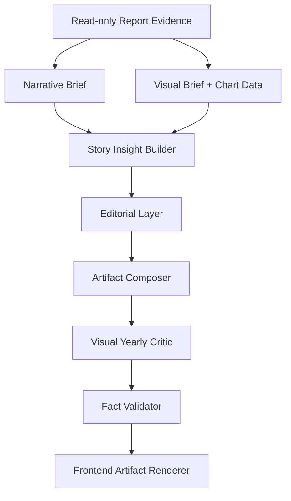

# AI Yearly Report Editorial Layer Design

> 创建日期：2026-07-04
> 状态：设计稿，待人工确认后进入 implementation plan
> 相关模块：`backend/domains/ai_reports/visual_yearly_artifact_service.py`、`backend/domains/ai_reports/story_insight_builder.py`、`backend/domains/ai_reports/narrative_quality.py`、`backend/domains/ai_reports/visual_yearly_critic.py`、`frontend/src/features/ai-insights/yearly-artifact/`

## 1. 背景

AI 年度报告已经完成两次关键升级：

1. `agentic_longform` 让 Report Agent 通过只读工具自主查询播放数据、个人 Billboard、流派、高光日和发现回归，而不是一次性把所有数据塞给 LLM。
2. `visual_yearly_artifact` 让年度报告从 Markdown 文本升级为结构化图文年报，包含章节、洞察卡片、图表规格和确定性图表数据。

这两步解决了“数据能不能查”“事实是否安全”“前端能不能展示图表”的问题。但最新 2026 年报仍然暴露出更高层的体验问题：

- 它能拿到数据，却仍有较强的数据罗列感。
- 它能生成章节，却缺少清晰的素材分配，导致同一事实在摘要、正文和图表说明里重复出现。
- 它能写故事化语言，却容易反复使用“入口、声音线、坐标、陪伴、地图”等模板词。
- 它能避免编造具体生活事件，但因此在生活节奏、个性偏好和音乐陪伴关系上的解释偏保守。
- 它能渲染图表，但图表和正文之间仍有重复或断裂：有时图表已经说了数字，正文又原样复述；有时正文没有真正解释图表里的转折。

本 spec 的目标是新增一层 **Editorial Layer**，把年报生成从“数据 + 图表 + prose composer”升级为“证据分配 + 章节职责 + 语言预算 + 叙事校准 + 质量审稿”的文章生产链路。

## 2. 产品目标

AI 年度报告应该像一篇写给用户本人的音乐年记，而不是播放分析页面的二次转述。

它应该做到：

- **有主线**：读者能在开头明白这一年最值得记住的音乐变化是什么。
- **有分工**：每个章节只解决一个问题，不把所有榜单和数字都堆进去。
- **有证据**：关键解释能追溯到播放记录、个人 Billboard、图表观察或实体统计。
- **有解释**：不止说“谁最多”，还要解释稳定、转折、偏爱、阶段变化和长期陪伴之间的关系。
- **有节制的生活感**：能从听歌密度、时段、持续性、语种/地域、回访周期推断音乐与生活节奏的关系，但不编造具体人生事件。
- **有阅读价值**：即使用户已经看过播放分析页面，也能从 AI 年报里获得新的理解。

## 3. 非目标

本轮不做：

- 重写 Report Agent 工具链。
- 改变 `visual_yearly_artifact` 的前端主结构。
- 增加 PDF、长图、分享海报或主题系统。
- 让 LLM 自由二次润色整篇文章。
- 引入任意 SQL、任意 URL 或外部官方 Billboard 查询。
- 把确定性图表数据交给 LLM 生成。

LLM 二次润色可以作为后续增强，但 v1 必须先用确定性编辑层解决素材分配和质量门禁，否则润色会变成不可控的文风漂移。

## 4. 核心判断

当前问题的根因不是模型智力不够，而是生成 harness 缺少类似编辑部的中间环节。

一个好的年报需要三次选择：

1. **选事实**：哪些事实值得写，哪些只适合放在图表里。
2. **选位置**：同一个事实应该属于哪一节，其他章节如何轻量引用。
3. **选解释方式**：这个事实说明的是稳定、转折、沉迷、探索、回归、阶段变化，还是榜单影响力。

如果没有这层选择，模型或模板很容易把所有数字平均撒进各个章节，结果就是“正确但无聊”。

## 5. 总体架构

在当前 `visual_yearly_artifact` pipeline 中插入 `Editorial Layer`：



`Editorial Layer` 不负责查数据，也不直接渲染 UI。它负责把已经查到的数据整理成一份可写作的编辑计划。

## 6. Editorial Layer 组成

### 6.1 Fact Ledger

`Fact Ledger` 记录所有可用于年报的关键事实，并给每个事实分配唯一主场。

示例结构：

```json
{
  "id": "artist_monthly_turning_point_olivia_may",
  "claim": "Olivia Rodrigo 在 2026-05 达到 105 次，超过 Taylor Swift 的 67 次。",
  "source": "chart_data.artist_monthly_trend.observations[0]",
  "home_section_role": "turning_point",
  "allowed_reuse": "short_reference",
  "interpretation_axis": "phase_shift"
}
```

规则：

- 一个事实只能有一个 `home_section_role`。
- 其他章节可以引用该事实，但不能原样复述完整句子。
- 图表 observation 如果已经完整展示，正文必须解释“这说明什么”，而不是再次报数。
- 核心年度概览数字只允许在 opening 或 overview card 中完整出现一次。

### 6.2 Section Role Contract

每个章节都必须有明确职责和禁止事项。

| 角色 | 应该做什么 | 不应该做什么 |
| --- | --- | --- |
| `opening` | 提出年度主题、时间范围和读者进入点 | 罗列 TOP 艺人、TOP 单曲、TOP 专辑 |
| `year_rhythm` | 解释活跃日、总时长、时段和听歌密度如何构成生活节奏 | 重复年度概览所有数字 |
| `main_artist` | 解释第一艺人为什么是稳定中心或核心陪伴 | 把艺人榜前五逐个念一遍 |
| `turning_point` | 展开月度趋势中的反超、阶段偏移或新峰值 | 只说“趋势发生变化”而不引用具体月份 |
| `album_story` | 分析播放量、专辑偏爱和个人 Billboard 的关系 | 当播放冠军和榜单冠军相同时写成“两种不同偏爱” |
| `highlight_day` | 拆解高光日是单曲循环、密集探索还是全天候背景 | 编造当天现实事件或情绪 |
| `discovery` | 解释新艺人、新语种、新流派是否形成有效新线索 | 把低播放的新发现写成年度主角 |
| `closing` | 总结这一年的音乐个性，并留下后续观察 | 再次复述所有排行榜 |

`Artifact Composer` 只能根据 section role contract 取用对应事实。这样即使不同年份结构不同，也不会退回固定模板。

### 6.3 Language Budget

新增语言预算，限制模板化表达。

首批预算词：

- “入口”
- “坐标”
- “地图”
- “声音线”
- “情绪线”
- “纹理”
- “陪伴”
- “主线”
- “稳定中心”

建议规则：

- 禁止词：内部产品/商业分析词，如 “综合来看”“三榜联动”“第二层证据”。
- 限量词：温暖但容易泛化的词，如 “陪伴”“入口”“主线”，全文最多 2-3 次。
- 替换要求：如果使用抽象词，同段必须包含一个具体实体、月份、播放数、榜单关系或时段证据。
- 收束段可以写后续观察，但不能用空泛的“继续观察某某走势”替代年度总结。

目标不是让文风变冷，而是避免用抽象词遮住真实洞察。

### 6.4 Chart-Prose Bridge

每个图表生成两类信息：

- `observation`：图表能直接读出的事实。
- `interpretation_prompt`：这个事实值得如何解释。

示例：

```json
{
  "chart_id": "artist_monthly_trend",
  "observation": "Olivia Rodrigo 在 2026-05 达到 105 次，超过 Taylor Swift 的 67 次。",
  "interpretation_prompt": "把它解释为上半年后段的阶段性偏移，不要在其他章节重复完整数字。"
}
```

章节正文必须满足：

- 引用图表的章节至少使用一个 `observation` 或其归纳版本。
- 不能与图表说明原句完全重复。
- 必须增加解释句，例如“这说明第二条线不是全年平均铺开，而是在某个阶段突然变亮。”

### 6.5 Narrative Inference Calibrator

为了让年报有生活感，但不幻觉，需要定义可用推断范围。

允许的推断：

- 听歌密度高 -> 音乐更像日常背景或能量来源。
- 活跃日接近全年 -> 音乐贯穿生活节奏。
- 单艺人/单专辑集中度高 -> 用户有稳定回访对象。
- 月度趋势突然上升 -> 某个阶段出现新沉迷或新关注。
- 深夜比例高 -> 音乐可能承担夜间陪伴或情绪沉淀。
- 新艺人从某月开始持续出现 -> 这是新发现进入听歌结构的证据。

禁止的推断：

- 具体天气、地点、通勤、考试、分手、旅行、加班等无数据事件。
- 心理诊断或人格标签化判断。
- 把流派标签当作互斥事实。
- 把个人 Billboard 写成外部官方 Billboard。

推荐句式：

- “从数据上看，它更像是……”
- “这不一定对应某个具体事件，但说明……”
- “如果说播放量代表当下想听，个人榜单更像是持续留下的痕迹……”

### 6.6 Editorial Critic

现有 critic 已经能检查长度、章节数、图表数、术语泄漏和部分重复。需要升级为“编辑审稿”：

新增 hard blockers：

- `duplicate_fact_home`：同一核心事实在多个章节完整复述。
- `chart_prose_echo`：正文和图表 observation 原句高度重复，且没有解释增量。
- `section_role_violation`：章节内容不符合 role contract。
- `generic_language_overuse`：模板词超过预算。
- `data_listing_without_interpretation`：连续多个句子只报数字，没有解释句。
- `unsupported_life_claim`：出现无证据生活事件推测。
- `billboard_scope_leakage`：没有明确个人 Billboard 口径，或写成外部官方榜单。

soft warnings：

- `weak_closing`：结尾只是“继续观察”，没有总结音乐个性。
- `thin_emotional_reading`：事实正确但缺少生活节奏/偏好结构解释。
- `underused_visual_evidence`：有图表但正文没有真正利用。

hard blocker 必须阻止缓存；soft warning 可以记录进 metadata，供后续迭代。

## 7. 数据模型

新增后端内部模型，不要求前端立即感知全部字段。

```python
@dataclass(frozen=True)
class EditorialFact:
    id: str
    claim: str
    source: str
    home_section_role: str
    allowed_reuse: str
    interpretation_axis: str


@dataclass(frozen=True)
class SectionPlan:
    role: str
    heading_hint: str
    owned_fact_ids: tuple[str, ...]
    referenced_fact_ids: tuple[str, ...]
    required_interpretation_axes: tuple[str, ...]
    forbidden_moves: tuple[str, ...]


@dataclass(frozen=True)
class EditorialPlan:
    thesis: str
    facts: tuple[EditorialFact, ...]
    sections: tuple[SectionPlan, ...]
    language_budget: dict[str, int]
    inference_rules: dict[str, tuple[str, ...]]
```

`visual_yearly_artifact.metadata` 可以增加：

```json
{
  "editorial_plan_version": "yearly_editorial_v1",
  "fact_count": 18,
  "section_roles": ["opening", "year_rhythm", "main_artist", "turning_point", "album_story", "highlight_day", "closing"],
  "critic_warnings": []
}
```

前端可以先不展示这些 metadata，只作为调试和测试依据。

## 8. 与现有模块的关系

### `visual_chart_data.py`

继续负责生成确定性图表数据，但需要保证每个关键图表都有 `observations`。

### `story_insight_builder.py`

继续负责把上下文转成关系判断，例如专辑播放冠军与个人榜冠军是 aligned 还是 divergent。Editorial Layer 消费这些 insight，并决定它们进入哪个章节。

### `dynamic_outline.py`

继续选择章节角色和顺序。Editorial Layer 不重复做 outline，而是给 outline 填充事实归属和写作约束。

### `visual_yearly_artifact_service.py`

需要从“按固定函数拼章节”改成“按 `EditorialPlan.sections` 写章节”。每个 section composer 只接收自己拥有的 facts 和允许引用的 facts。

### `narrative_quality.py` / `visual_yearly_critic.py`

需要升级为基于 `EditorialPlan` 的审稿，而不只是扫描最终文本。

### 前端 artifact renderer

本轮不需要重做视觉结构。但可以做两个小调整：

- 如果 chart observation 已经在正文展开，图表下方 caption 使用更短的 label，避免用户看到重复句子。
- 在调试 metadata 中保留 `section_roles`，方便浏览器验收定位问题。

## 9. 生成流程

1. Report Agent / deterministic tool layer 产生年度 evidence、narrative brief、visual brief、chart data。
2. `story_insight_builder` 产出专辑关系、月度转折、高光日类型、新发现强度等结构化 insight。
3. `dynamic_outline` 根据年份信号选择章节角色。
4. `editorial_layer` 构建：
   - fact ledger
   - section role contract
   - fact ownership
   - language budget
   - inference rules
5. `artifact composer` 按 section plan 写 prose。
6. `visual_yearly_critic` 同时检查 artifact 与 editorial plan。
7. 通过后才写入 task result/cache。

## 10. 验收标准

以 2025 和 2026 年报作为首批真实数据验收样本。

### 结构验收

- 年报仍返回 `report_mode = visual_yearly_artifact`。
- 至少 6 个章节、4 个图表、3 个 insight cards。
- metadata 包含 `editorial_plan_version` 和 `section_roles`。
- 年中报告继续明确“截至数据截止日”。

### 内容验收

- 开头不再罗列所有 TOP 榜单，而是提出年度主题。
- 同一核心数字或观察不得在相邻章节重复完整出现。
- 图表 observation 与正文不得原句重复；正文必须有解释增量。
- 专辑播放冠军和个人榜冠军相同时，写成“热度与长留重合”；不同时，写成“当下重复聆听 vs 持续在榜影响”。
- 至少一处解释播放数据和个人 Billboard 的关系。
- 至少一处解释生活节奏或听歌习惯。
- 至少一处解释新发现、阶段偏移或口味变化。

### 风格验收

- 不出现内部术语或商业报告腔。
- “入口、坐标、地图、声音线、情绪线、陪伴、主线”等词不超过预算。
- 每个主要章节至少包含一个具体实体、时间点、播放关系或榜单关系。
- 不编造具体人生事件。
- 读起来像文章，而不是 API 摘要。

### 浏览器验收

- 在 `/ai-insights` 手动刷新 2025 和 2026 年度报告。
- 确认刷新后内容实际变化或 timestamp 明确更新。
- 检查报告可见、图表可见、无横向溢出、无 console error。
- 人工阅读至少两个章节，确认图表和正文互补而不是重复。

## 11. 测试策略

### Unit tests

新增或扩展：

- `test_editorial_plan.py`
  - fact ownership 唯一。
  - section role contract 生效。
  - language budget 生效。
  - chart observation 被分配到唯一主场。

- `test_narrative_quality.py`
  - 重复事实触发失败。
  - 图表-正文原句重复触发失败。
  - 只有数字没有解释触发失败。
  - 无证据生活事件触发失败。

- `test_visual_yearly_artifact_service.py`
  - 2026-like context 生成 section roles 和 editorial metadata。
  - aligned album relation 不写 false contrast。
  - dynamic outline section 不重复 opening facts。

### Probe

扩展 `scripts/probe_visual_yearly_report_artifact.py`：

- `--mode changed`：只抽查最近改动影响的年份。
- `--mode full`：覆盖 2022-2026 可用年份。
- 检查 editorial plan metadata、fact duplication、language budget、chart-prose echo、Billboard scope wording。

### Frontend tests

前端只做轻量回归：

- artifact renderer 仍能渲染章节、洞察卡片和图表。
- metadata 不存在时仍能回退旧报告。
- chart caption 不因缩短而丢失可访问文本。

## 12. 风险与取舍

### 风险：规则过强导致报告僵硬

缓解：critic 分 hard blocker 和 soft warning。只有事实重复、术语泄漏、无证据推断等问题阻止缓存；“情绪不够强”只记录 warning。

### 风险：每年结构差异变大，测试难写

缓解：测试章节 role 和义务，不测试完整文案。验收关注“是否解释了图表”“是否重复事实”“是否使用个人 Billboard 边界”，而不是要求固定句子。

### 风险：去模板化后文风变散

缓解：保留 thesis、section role 和 interpretation axis。去掉重复模板词，不等于取消结构。

### 风险：只靠确定性规则不够文学化

缓解：v1 先保证素材分配和事实安全。v2 可以加入 LLM rewrite pass，但必须受 `EditorialPlan` 约束，并在 rewrite 后重新通过 critic。

## 13. 后续演进

v1：确定性 Editorial Layer。

- 解决重复、模板词、章节职责、图表-正文关系。
- 不引入 LLM rewrite。

v2：受约束的 LLM stylistic rewrite。

- 输入 `EditorialPlan + artifact draft`。
- 只允许改写表达，不允许改数字、实体、图表或 section roles。
- rewrite 后必须通过 fact validator 和 editorial critic。

v3：用户风格偏好。

- 可选“更温暖 / 更克制 / 更数据 / 更像年记”。
- 仍由同一 Editorial Layer 保证事实边界。

## 14. 成功定义

这次修复成功的标志不是“报告变长”，而是：

用户读完之后能说出：

1. 这一年我的音乐生活最主要的变化是什么。
2. 哪些数据支持这个判断。
3. 播放次数和个人 Billboard 共同说明了什么。
4. 哪些音乐更像长期陪伴，哪些更像阶段性沉迷或新发现。
5. 这篇 AI 年报提供了播放分析页面没有直接给出的解释。

如果报告只是更长、更漂亮，但仍然在重复排行榜，它就没有通过本 spec。
