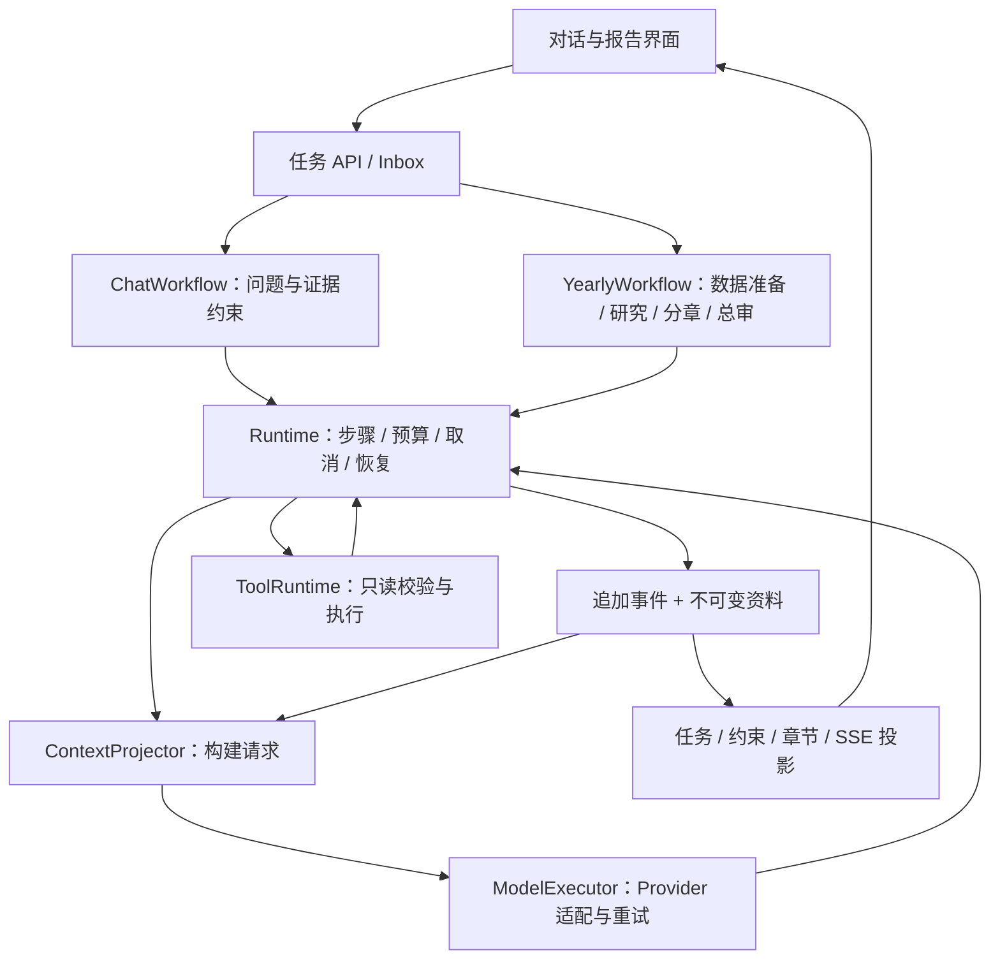

# AI Agent V6 统一运行时、报告恢复与交互优化规划

> 创建日期：2026-09-22
>
> 实现状态：`SIXTH_ROUND_COMPLETE`；验证状态：`LOCAL_PASS`
>
> 仓库状态：实现提交 `8edcd1c8`，集成提交 `1f5863a8` 已进入 `main`；业务代码已推送并随 `194fd113` 于 2026-09-30 发布。
>
> 文档状态：`ARCHIVED / COMPLETED_AFTER_L3_COUNT_RECONCILIATION`；最后状态核验：2026-10-02。当前全栈、生产真实模型和终端验收边界见 [开发状态总表](../../DEVELOPMENT_STATUS.md)。
>
> 规划形成时的源码基线：`main`，`49bfadfdd8d87d1bedb7d52b0788f53e0f219cfa`。此 SHA 用于回溯，不代表当前主分支。

> 下文保留实施时的计划、停止条件和历史验收范围，不再作为未完成开发路线；其中“未 commit、push 或部署”均描述记录形成时。以下第六轮记录对应合并前候选；主分支集成与当前迁移编号见[本地集成报告](../../reports/2026-09-27-ai-agent-v6-local-integration.md)。

> 2026-09-27 第六轮完成：L3 composition 下 `vampire` 的旧 v11 快照 381 次与规范成员事件 380 次差异已关闭；v12 四变体重建、12/12 代表组合、动态/固定阈值各 493/493 多成员 L3 组对账、固定 11 题真实模型和默认完整 run `20260927T123442.686018Z-e24f493b421d` 均通过。第五轮及第六轮中间失败 run 继续保留为历史证据。当前证据见 [`../reports/2026-09-22-ai-agent-v6-final-acceptance.md`](../../reports/2026-09-22-ai-agent-v6-final-acceptance.md)。未 commit、push 或部署。

## 1. 目标与完成定义

V6 的目标是让现有 AI 对话和年度报告共享可靠的执行底座，让年报中断后可以继续，并让用户更早看到可信结果。保留 SpotifyStats 的统计规则、只读权限和事实审核，按实际测量改善问答质量、等待时间与调用成本。

V6 必须交付四项结果：

1. **统一运行机制**：问答、年报补充研究与章节模型调用共用模型执行、预算、事件、取消和恢复基础能力；各自保留业务编排。
2. **持久化与恢复闭环**：模型请求可从持久事实重建；问答和年报均能从已提交检查点恢复，不重复消费已保存的合格成果。
3. **可信的渐进展示**：进度反映实际执行；年报章节通过审核后可提前阅读；最终报告发布仍经过完整审核。
4. **质量和成本可验收**：历史用例无退步，新自由问法有独立评测，耗时、模型用量、重试和回退有原始记录。

“V6 本地完成”要求 V6-S0—V6-S6 的必需门禁全部闭合，并有一次默认完整全栈 Pass。生产启用独立记录，不能用本地完成替代上线验收。真实模型条件缺失时可以继续完成模拟、契约和前端工作，但真实模型验收保留 `NOT_RUN / PARTIAL`。

## 2. V5 基线及此次需要解决的问题

### 2.1 已经存在的能力

- 原生 tool calling、Turn/Step 循环、类型化只读工具、证据和答案契约。
- 会话 Inbox、运行中转向、工具缓存与去重、预算、重试和受控并行。
- 持久任务、Worker lease、问答事件恢复、复合 SSE cursor。
- 年报精确上下文快照、六章分别写作、章节质量检查、最终事实和 artifact 门禁。
- 缓存优先与手动生成、桌面和移动端 AI 页面。

V5 功能已经进入主线。`AI_AGENT_RUNTIME=v2` 是运行时的历史标识，不是产品仍停留在 V2。V6 不通过批量改名来证明架构升级。

### 2.2 源码确认的缺口

| 缺口 | 当前证据 | V6 对应工作 |
|---|---|---|
| 正常上下文仍维护内存消息 | `AI_AGENT_CONTEXT_SOURCE` 默认 `memory`；`select_context_messages()` 提供初始投影选择，循环中仍维护消息 | 每次模型请求以已提交事件和不可变请求资料构建上下文 |
| 问答和年报执行机制分叉 | Chat 使用 `AgentRuntime`；报告研究使用较轻的 `NativeObservationLoop`；章节 writer 独立执行 | 提取共用内核与单步模型执行器，保留领域工作流 |
| 年报检查点尚不能代表进程恢复 | `list_recoverable_agent_runs()` 仅选择 `ai_chat_agent`；章节结果先在本进程汇总 | 逐章持久提交、恢复分派和版本匹配 |
| SSE 正文在终态后才发送 | `ai_tasks.py` 只在任务终态后拆分最终答案 | 增加已审核章节的持久事件与查询投影 |
| 模型调用仍为同步请求 | `ConfiguredNativeToolModel.complete()`；任务在应用后台线程内执行 | 统一取消边界、超时、租约和关闭行为 |
| 工具选择依赖固定问题类别 | `tool_selector.py` 按 QuestionFrame 选择有限工具 | 用自由问法和多轮评测补齐可达路由、歧义澄清与受限扩展 |

详细源码入口见第 11 节。当前普通工具注册表中的 `web_search` 是受限 Wikipedia 工具，不能据此宣称默认问答或报告具有通用网页能力；实施时以实际 profile 和调用链为准。

### 2.3 历史实测只作为参考

| 日期 | 已记录结果 |
|---|---|
| 2026-08-31—09-01 | 问答 33/33 Pass，Turn P95 42.087s；年报冷/热 123.825s / 81.472s；问答崩溃恢复和 SSE 通过 |
| 2026-09-13 | 问答 10/10 Pass；其中 7 题门禁 Turn P95 46.331s；年报两次 45.581s / 32.686s，均 6 章模型写作、0 回退 |
| 2026-09-21 | 后续默认完整本地全栈 Pass；该轮未调用 LLM，不能作为新一轮真实 AI 验收 |

历史 141 题是静态问题矩阵，不能当成 141 题真实模型通过。生产最后一份相关验收记录为“代码已部署、服务器无 LLM 凭据”；V6 开始或发布时重新确认，不能推定今天已可在线使用。

参考：[V5 专项验收](../../reports/2026-08-31-ai-agent-performance-v5-acceptance.md)、[9 月 13 日真实模型与发布验收](../../reports/2026-09-13-development-closeout-and-release.md)、[后续全栈验收](../../reports/2026-09-21-stage7e-final-fullstack-acceptance.md)。

## 3. 范围和不做项

### 3.1 必做范围

- AI 问答、年度视觉报告的补充研究和章节写作。
- 与上述链路直接相关的事件、请求上下文、任务恢复、租约、取消、预算和持久化。
- AI 页面进度、约束回执、澄清、年报渐进展示、刷新和重连。
- 真实模型评测、故障注入、数据隔离和必要的模型/API/前端类型同步。
- 当前统计口径、快照状态与缓存版本的正确传递。

周报、月报保留固定工作流；若改动共用 Provider 或任务服务，必须回归其缓存、生成和取消行为，但本轮不把它们改造成自主研究 Agent。

### 3.2 不纳入 V6

- 多 Agent 协作、动态插件市场、MCP 平台化、任意 Shell/SQL/URL 或写操作。
- 分布式调度平台、跨主机执行、引入新的消息中间件。
- 新的播放统计定义、全站快照再设计、整站 UI 重做。
- 自动生成报告、长期后台自治、自动学习用户画像或新的长期记忆产品。
- 默认展示未经审核的模型正文、思维链或内部提示词。
- 自动复制本地凭据、修改生产配置、push、部署。

已有问题若不由 V6 引入、也不阻塞 V6 必需门禁，单独记录，不顺带扩展实施范围。

## 4. 目标架构与责任边界

沿用此前讨论中的“小循环、标准接口、事件保存事实”方向；直接演进当前 Python/FastAPI/SQLite 实现，不引入 Pi 或 DeepSeek Harness 作为运行依赖。

| 模块职责 | 应包含 | 不应包含 |
|---|---|---|
| Runtime / ModelExecutor | 模型步骤、预算、重试、取消、事件提交、恢复控制 | Spotify 统计实现、UI 文案、直接获取全局数据库连接 |
| EventStore / ContextProjector | 追加事实、顺序、请求构建、版本化投影、恢复所需资料 | 独立维护另一套模型消息真相 |
| ToolRuntime | schema、只读策略、过滤条件、结果归一、调用身份、去重 | 任意路由或 SQL 透传 |
| ChatWorkflow | 意图、实体消歧、分析约束、证据契约、澄清和答案审查 | 另一套模型重试/恢复循环 |
| YearlyWorkflow | 上下文、报告计划、研究、章节依赖、最终审查和发布 | 另一套底层模型执行器 |
| TaskHost | SQLite 事务、lease、后台线程生命周期、启动恢复 | 模型自主决定调度或扩大权限 |

允许领域代码通过明确的策略接口在步骤前后参与，接口先覆盖当前两个消费者。章节写作使用共用单步执行器，研究使用工具循环；不能为了统一强迫每个章节调用工具或重走研究阶段。继续使用现有应用内执行方式，先修复其生命周期。

## 5. 持久化、上下文与恢复契约

### 5.1 事实源与可重放范围

每次模型请求必须能从已提交的记录重建，包括 system/user 消息、工具 schema、工具 observation、转向/澄清输入、上下文压缩结果，以及影响请求的模型标识、参数和提示词版本。凭据通过运行配置重新取得，不进入日志。

追加事件是模型执行事实源。任务状态表、聊天展示、工具轨迹和章节列表是投影或与事件同事务更新的索引。内存对象可以缓存投影，但不允许持有无法重建的独有语义。Provider 必需的续接资料沿用现有受保护、脱敏存储规则，不发送给前端。

实现要求：

1. 每次请求前提交输入和请求描述，之后从投影构建请求；恢复时不用当前模板悄悄重写历史 prompt。
2. 模型返回的消息与其 tool call 关系完整记录；工具结果提交后才能进入下一请求。
3. 上下文压缩是有输入范围、有版本、有持久输出的事件；恢复不能重新生成一个不同摘要。
4. 长日志用可验证的投影检查点和增量折叠，避免每一步扫描全部历史；检查点可由底层事实重建。
5. 事件有 schema 版本、任务代次、步骤/调用标识和严格递增序号。具体表结构在 V6-S1 对现有 schema 核对后确定，不预占 migration 编号。
6. 大型结果保留精确的模型可见压缩观察，原始资料需要引用时必须是任务生命周期内不会失效的不可变资料；不能只保存指向可能被淘汰缓存的 key。

“可重放”表示上下文、已完成操作及状态可以重建，不保证再次请求随机模型会逐字返回相同正文。

### 5.2 原子性、幂等和租约

- 工具完成事实与对应模型观察应原子提交，或存在经过故障注入验证的确定性补全规则，覆盖当前分开写入的崩溃窗口。
- 调用复用身份包含任务代次、约束版本、工具及规范化参数、数据语义版本；同名参数不能跨新旧数据或新旧要求复用。
- 模型已返回但未落盘时允许重新请求，记录可能重复的调用与费用；不承诺 Provider 外部调用 exactly-once。
- 任务事实、事件和主库投影尽可能在同一 SQLite 事务提交。跨主库与报告 sidecar 使用不可变产物标识和可重试的发布顺序，不假设跨库天然原子。
- lease 带所有者及接管代次；写入校验当前所有权。已失去 lease 的旧 Worker 即使后来收到模型结果，也不能覆盖新 Worker 的成果。
- 事件序号分配和唯一性依靠事务/约束保障；并行章节不能共享不安全连接，线程只将结果交给受控提交边界。
- 恢复不重置已消耗的步骤、调用、重试和 token 预算。排队时间、等待用户时间、有效执行时间与真实墙钟时间分开记录。

### 5.3 运行与取消状态

任务保留现有终态 `done / error / cancelled` 和 `queued / running / cancelling`。为交互澄清新增 `awaiting_input` 的计划必须在 V6-S4 同步 Pydantic、OpenAPI、前端类型、恢复查询和超时语义；不能仅靠 UI 文案伪造状态。

- 用户取消先持久化意图并快速 ACK，界面进入“正在停止”；运行器在提交、下一模型请求和工具派发前检查。
- 对可中断 Provider 传递取消信号；同步在途请求无法中断时，等其结束或超时，丢弃迟到的业务成果，不继续派发。
- `cancelled` 表示该任务已不会提交新业务成果或启动新调用；迟到请求的计费用量可以作为审计补记保留。
- 取消和完成竞争由事务决定：已完成则返回完成事实，先接受取消则不能又发布成功。
- 服务关闭先停止接收新工作并收敛自有 Worker；进程意外终止由 lease 到期后的恢复接管处理，不杀死其他会话或用户服务。

### 5.4 数据版本与业务适配

复用项目已有 revision、filter fingerprint、实体 identity 与已发布快照语义，不再设计另一套播放统计口径。

- Chat 的每份证据记录数据范围、次数/时长轨道、合并设置、L2/L3、数据版本和新鲜度。
- `ready / warming或stale / unavailable / failed / empty` 保持可区分；不可用不能转成零播放或无数据。
- 年报开始时固定完整共享上下文和确定性图表。研究与写作只消费这一代资料。
- 正式源发生变化，但所有后续操作均可由固定资料完成时，允许完成旧版本报告并明确数据截止范围；缓存按旧版本保存，不能覆盖新版当前指针。
- 恢复时缺失固定资料，或后续工具必须读取无法重建的旧版本数据，则停止该代生成并提供按最新数据重试入口，不能混合版本。
- 转向导致约束变化时使不再匹配的证据失效。年报生成中更改年份/过滤条件以新代次重新开始；V6 不做任意中途改写整份年报目标。

## 6. 年度报告恢复与渐进发布

### 6.1 业务阶段

`准备固定上下文 → 确定性图表与研究 → 固定章节计划 → 分章写作和审核 → 全文审核 → 发布缓存`

报告阶段由 YearlyWorkflow 控制。每个模型步骤交给共用运行内核，阶段完成结果逐项持久保存。沿用当前六章结构和最多两个章节并发，只有测量证明必要才调整并发。

### 6.2 章节检查点需要保存的内容

| 内容 | 用途 |
|---|---|
| 任务 ID、生成代次、稳定章节 ID、顺序 | 区分章节身份，恢复后维持原顺序 |
| 固定上下文与约束版本 | 防止跨数据、跨范围复用 |
| 章节计划、prompt/writer/validator 版本 | 判断旧成果是否仍满足当前恢复协议 |
| 正文、图表引用、证据引用 | 恢复后直接阅读和组装 |
| 审核结果、重试记录、模型用量 | 判断可复用与剩余预算 |
| 来源为模型或确定性补齐及其原因 | 保持用户可见的回退说明 |

章节内部状态建议为 `pending / writing / validated / failed`；最终发布状态另行记录。逐章审核后立即持久提交，不能等六章全部结束才汇总保存。

恢复规则：

- 版本兼容且 `validated` 的章节直接复用，不再次调用 writer。
- 仍为 `writing` 且没有已提交结果的章节可重试，继承预算。
- 失败章节按既有有限重试和确定性补齐策略处理；错误不能标为完成。
- writer/validator 协议不兼容时不盲目恢复：兼容适配或明确重新生成，策略由任务固定版本决定。
- 上下文缓存淘汰不能删除活动任务恢复所需的唯一资料；任务结束后的保留与清理由现有任务/缓存生命周期扩展实现。

### 6.3 审核通过的章节与完整报告分离

用户可以先看到“已完成 2/6 章，完整报告仍在生成”。显示的是已提交且通过章节审核的正文；每章包含稳定版本，浏览器刷新后仍可取回。

全文审核仍检查跨章节口径、重复与矛盾、图表对应、证据覆盖和 artifact 完整性。全文审核失败时，任务不能 `done`，不能进入正式成功缓存。受影响章节撤下或标记待修复，并发送持久失效事件；修复只重做必要章节，随后重新总审。

跨库发布顺序为：保存不可变候选 artifact → 提交发布事实/当前有效引用 → 更新可重建缓存投影。任一步中断都能重试或完成对账。缓存读者只读取有完整发布凭证的版本；保存候选成功不等于已发布。

V5 验收脚本中“最多 2 章回退”首先是验收门槛，不能未经核对写成当前所有运行路径都有硬限制。V6 将其落实为完整报告发布门禁：超过 2 章补齐时，本次生成以明确的质量未达标错误结束，不写入新的成功缓存；已审核部分仍可查看并标注报告未完成，已有成功报告保留。最多 2 章补齐且通过全部审核时允许发布，界面明确显示补齐数量。S3 必须验证这两条路径。

## 7. API、交互和问答质量

### 7.1 增量交互合同

- 复用现有 task、trajectory、Inbox 和 stream 入口，以必要的字段/事件扩展支持 V6；新增章节读取接口仅在现有任务响应无法合理承载时增加。
- 章节展示事件包含 `task_id / generation / section_id / section_version / sequence`；前端按身份更新，不按网络包次数追加。
- SSE 从持久事实派生；进度、工具、章节与终态共享明确顺序。新 cursor 使用版本化协议，支持旧 v1 cursor 的兼容读取和显式重同步。
- 浏览器遵循“读取快照及其水位 → 订阅水位之后的事件”，覆盖读取与订阅之间的竞态。重连最多造成可去重的传输，不应重复章节或丢失终态。
- 未知 cursor 或过期保留窗口返回明确的重同步指示，不默默回到开头制造重复正文。
- 任务状态、章节快照通过 TanStack Query 获取；SSE 更新 Query 状态，断流时使用受控查询恢复。
- 用户文案表达实际动作和分析范围，不显示 checkpoint、lease、revision 等内部术语。进度百分比若无可靠分母，使用阶段或完成章节数。
- 保留 Markdown 清洗、图表懒加载、Phone/Compact/Desktop 互斥布局、44×44px 主要触控目标。

### 7.2 转向与澄清

- 运行中补充要求区分“已收到”“已应用”“需要澄清”；只有持久消费且约束已更新才显示“已应用”。
- `steer` 在下一安全步骤应用，`followup` 保持下一轮语义；临近完成时到达的输入须明确接入后续任务或返回可重试回执，不能丢失。
- 模糊实体、缺失年份或无法确定比较范围时，只询问影响结果的关键项，优先提供真实候选。
- `awaiting_input` 不占模型执行线程/lease，不消费有效运行时间；刷新或重启后可以继续回答。重复提交澄清答复需幂等处理，取消后不再恢复执行。
- 简单且上下文已明确的问题直接执行，不能靠大量澄清规避实际回答。

### 7.3 工具路由与答案质量

保留 QuestionFrame、AgentProfile 和现有证据门禁。先通过新评测定位漏路由，再在当前只读注册表内支持有限的工具集合扩展。扩展需记录理由、遵守用户排除条件、受同一预算约束，不能一次暴露全部工具来替代路由判断。

评测按任务完成度、时间和实体正确性、数值证据、要求覆盖、简洁可读性分别记录。确定性断言负责可计算事实；人工检查负责是否回答了问题和澄清是否必要。模型自评不能单独决定通过。

## 8. 分阶段实施与退出条件

各阶段完成实现、针对性验证和证据记录后才能推进依赖阶段。遇到失败先收敛本阶段，不通过切到后续阶段掩盖缺口。本规划本身不执行以下工作。

| 阶段 | 主要交付 | 必需退出条件 |
|---|---|---|
| **V6-S0 基线与评测合同** | 当前代码/模型/数据基线；真实调用链与状态盘点；固定问题集、故障场景、测量定义和调用预算 | 能重跑同一任务集；历史与当前问题分开；正式数据隔离；样本/预算/阈值在优化前冻结 |
| **V6-S1 事件和恢复契约** | 版本化事件、每请求上下文投影、调用身份、事务/lease 接管、兼容读取和必要迁移 | 正常/恢复请求投影等价；关键写入窗口故障注入通过；旧数据可读；累计预算不重置 |
| **V6-S2 统一执行内核** | Chat 和报告研究接入共用工具循环，章节 writer 接入共用模型执行器；取消、重试和预算统一 | Chat 既有合同不退步；研究和 writer 无独立底层执行逻辑；Provider 模拟与只读边界全部通过 |
| **V6-S3 年报持久恢复** | 固定上下文与计划、逐章提交、报告恢复分派、总审与幂等发布 | 三章完成后强制终止可继续；合格章节不重写；数据漂移、缓存淘汰与跨库发布中断有正确结果 |
| **V6-S4 渐进展示与控制** | 已审核章节展示、版本化 SSE、查询重同步、转向回执、澄清与取消 UI | 刷新/断网/恢复无重复或丢失；失败不显示成功；三浏览器与手机交互通过 |
| **V6-S5 质量和性能收口** | 新自由问法修复；受限路由扩展；按 S0 profile 消除重复数据准备/上下文/调用；成本统计 | 第 9 节真实问题集、报告、预算和性能门禁满足；没有通过增加回退或减少审核换取速度 |
| **V6-S6 完整验收与文档收口** | 迁移/回退演练、完整默认全栈、真实模型及故障证据、当前规则文档 | 全部必需门禁有同版本证据；本地验收与生产启用分开；计划状态据实更新 |

依赖顺序：`S0 → S1 → S2 → S3 → S4 → S5 → S6`。S4 的协议设计可在 S1 一并明确，实际消费需等待 S3 的持久章节事件。禁止在单独 Chat 切换成功后直接宣称运行内核统一完成。

如后续获准提交，建议按上述阶段成组提交；共享模型/API/迁移存在依赖时合为可构建检查点，不做不可运行的细碎提交。每阶段报告记录实际 SHA、测试范围、未解决项和下一阶段前提。

## 9. 验收矩阵与量化目标

以下是 V6 在实施前冻结的门禁。最终执行结果见验收报告；阈值未在看到 V6 结果后放宽。

### 9.1 问答与报告质量

| 类别 | 样本与方法 | 通过条件 |
|---|---|---|
| 历史问答 | 恢复 V5 的 33 题 ID 与请求；S0 核对与当前统计规则的差异 | 33/33 通过；过时的预期必须有统计规则依据，不能为迁就答案改预期 |
| 新自由问法 | 新增 24 个不与历史集重复的场景：自然改写、指代、多轮、模糊实体、组合维度、转向，各 4 个 | 全部预定义必需断言通过；每题达到正确回答或事先定义的必要澄清/准确能力边界，不能用泛化拒答计通过 |
| 稳定性 | 上述集合选 12 个覆盖主要类别的场景，每个累计运行 3 次 | 每次必需事实与约束断言通过；保留模型表达变化、失败和修复前结果 |
| 事实与安全 | 数值 evidence、年份/实体/过滤范围、排除要求、只读拒绝 | 接受并展示的答案无未支持数值与关键事实；无越权调用；工具不可用和无数据正确区分 |
| 年报真实生成 | 一个完整年度 3 组冷/热成对样本；另测部分年度和无数据年份 | 有数据的完整报告通过章节/总审/图表门禁；每份最多 2 章明确补齐；无数据不生成虚假叙事 |
| 人工阅读 | 复核全部新增场景最终答案及真实生成报告 | 回答问题、保留必要边界、无重复赘述；记录问题与处理，不以数值覆盖率代替阅读质量 |

同一批样本可以同时提供质量、耗时和用量证据，不额外重复调用。57 个场景各一次加 12 个场景各追加两次，构成每个正式版本最多 81 次场景执行；多轮场景的实际模型调用数另计。报告正常性能样本为 6 次，另加两个边界年份场景。故障样本优先使用模拟 Provider，真实模型端到端恢复只做必要的代表场景。

S0 在调用前按模型配置估算总调用/token 上界并设置执行预算；无价格数据时只报告 token 和请求数，不伪造金额。失败只在诊断后重跑受影响项，所有失败样本保留；最终性能比较使用同一稳定代码上的完整预定样本。

### 9.2 性能、响应和成本

| 指标 | 定义与目标 |
|---|---|
| 接单与控制回执 | 隔离本地 API，排除模型耗时；创建任务、steer、cancel 的 ACK P95 ≤ 1s |
| UI 反馈 | 持久事件可用到页面显示，在受控本地网络下 P95 ≤ 1s；断网等待单独统计 |
| 问答总耗时 | 与历史可比的固定 33 题 Turn P95 ≤ 60s，Tool P95 ≤ 45s；额外按简单/复杂/澄清分层展示，拒绝题不能用来稀释可执行问题耗时 |
| 年报硬门禁 | 3 个冷样本每次 ≤ 240s，3 个热样本每次 ≤ 180s；冷上下文构建 1 次，热上下文构建 0 次 |
| 性能不退步 | 同机同数据同模型对比 S0，匹配样本的问答中位数及年报冷/热中位数不高于基线 115%；Provider 波动使比较无效时记 Partial 并保留原样本，不反复抽到合格为止 |
| 首个可信内容 | 年报记录首个合格章节持久化和显示时间；对所有正常完整报告，至少一个章节在整份报告发布前可见 |
| 渐进展示收益目标 | 首章可读时间中位数争取比整份完成时间提前 ≥ 30%；这是体验优化目标，未达标须报告原因，不替代硬门禁 |
| 调用与用量 | 统计 prompt/completion/可用 reasoning/cache token、调用数、重试、fallback；Provider 不返回则标 unknown |
| 成本不退步 | 在两版均通过质量的匹配场景上，模型调用与总 token 中位数原则上不高于 S0 的 115%；必要的质量提升额外成本逐例说明，未解释超额不能称成本通过 |
| 恢复复用 | 已持久化且版本匹配的成功工具结果、合格章节，恢复后新增执行数为 0；外部请求返回前后的未提交窗口单独说明 |

S0 和最终测量保存全部样本、median、最大值及足够样本的 P95。六次报告只报告冷/热分组的三次样本和中位数，不宣称具有稳定 P95。固定模型/参数/数据范围，分别定义“报告上下文冷、底层发布快照就绪”和“上下文精确命中”；不能把后者标为完整冷启动。

性能采样避开其他测试 worker 和后台构建。复用现有主机锁与存储限制；检测到竞争时记录该窗口不可比较，不把竞争样本伪装成优化效果。全栈门禁已有样本数量和 500ms 等规则保持不变。

### 9.3 必需故障与兼容场景

1. 请求记录已提交、模型尚未返回；模型已返回、结果尚未提交。
2. tool call 已记录但未执行；工具完成事实与模型观察写入边界中断。
3. 第一章、第三章完成后进程退出；并行两章一成功一失败；最后一章完成但未总审。
4. 候选 artifact 已保存但发布事实未提交；发布已提交但缓存投影尚未完成。
5. lease 过期接管、旧 Worker 迟到、重复恢复扫描、终态任务再次扫描。
6. 在模型调用、工具执行、章节审核、最终发布处取消；取消与完成/重连竞争。
7. 源 revision 或用户约束变化；快照淘汰；旧 prompt/validator 版本；资料缺失。
8. SSE 在章节边界断开、重复/乱序到达、旧 cursor、新 cursor、快照读取与订阅竞态。
9. 澄清期间刷新/重启/取消；重复答复；临近完成到达的 steer/followup。
10. Provider 超时、429/5xx、空输出、无 tool calling、截断参数、重复调用、预算耗尽。
11. 未配置模型、公开展示面访问、脱敏、非允许工具和提示注入式越权请求。
12. 升级与回退后的旧任务、旧报告缓存、旧前端和中断中的新任务。

断言应检查最终业务结果和副作用次数，不仅检查出现了某个事件名称。模拟 Provider 负责稳定覆盖崩溃窗口；真实 Provider 负责证明代表性端到端链路可用，两者分别报告。

## 10. 兼容、迁移、灰度与回退

### 10.1 数据与协议迁移

- 实施前查询实际 schema，按仓库当前迁移顺序新增；验证空库→最新、当前主线库→V6、旧 V5 历史库→现有 repair→V6，迁移重复执行不破坏数据。
- 优先扩展现有任务和事件模型，只有逐章持久内容等确有独立生命周期时才新增表。
- 旧任务/报告保持可读；缺少完整事件的旧任务不能声称可恢复，也不能通过猜测补成 V6 已完成事实。
- 新任务固定 runtime/workflow/schema 版本，恢复按任务版本分派，不能跟随全局开关无声换引擎。
- 新状态、字段与 SSE 协议同步 OpenAPI、生成类型和前后端合同测试；兼容旧客户端读取完成报告。

### 10.2 切换顺序

1. 加入事件和投影能力，影子比较只比较上下文，不重复发起付费模型调用。
2. Chat 在隔离环境切换新内核并验证历史合同。
3. 年报研究和 writer 接入新内核，完成恢复后再启用渐进章节 UI。
4. 完成真实问答、报告及完整全栈门禁后，才将 V6 设为新任务默认。

在 `backend/core/config.py` 集中维护最少必要开关：执行路径版本和渐进展示开关；具体名称在 S1 确认。既有 `legacy` 是旧协议应急开关，不作为 V6 正常失败后偷偷改用文本 JSON 的兜底。

### 10.3 回退条件与动作

出现上下文重建不一致、旧 Worker 覆盖、成功章节丢失、跨版本事实混用、审核失败却发布成功或关键质量退步，应停止向 V6 分派新任务。

切回 V5 只影响新任务。V6 在途任务由兼容 V6 Worker 完成或明确取消，不能交给不理解其日志/章节协议的 V5 恢复器。代码回退前先处置在途任务；若旧版本不能安全读取新 schema，使用已验证的兼容版本或发布备份联合回退，不执行破坏性降级迁移。

## 11. 预计涉及的代码与文档

下表是实施落点，不要求每个文件都修改。新增模块以实际职责拆分为准，避免预建空抽象。

| 范围 | 当前入口 |
|---|---|
| Chat 编排与模型适配 | `backend/services/ai_agent_v2_service.py`、`backend/providers/llm/client.py` |
| 通用执行与事件 | `backend/domains/agent_runtime/{native_loop,event_log,projections,recovery,provider_reliability,tool_runtime,context_compaction}.py` |
| 领域工具与约束 | `backend/domains/ai_agent/`、`backend/domains/agent_runtime/{tool_selector,session_state,constraint_patch}.py` |
| 任务、lease、Inbox | `backend/services/ai_task_service.py`、`backend/domains/ai_tasks/repository.py`、`backend/models/ai_tasks.py` |
| 报告上下文与写作 | `backend/domains/ai_reports/{context_builder,context_snapshot,report_agent,section_writer,report_section_protocol,visual_yearly_artifact_service}.py` |
| API 和配置 | `backend/api/ai_tasks.py`、`backend/api/ai_insights.py`、`backend/core/config.py`、现有数据库迁移入口 |
| 前端 | `frontend/src/features/ai-insights/`、`frontend/src/api/ai-task-stream.ts`、`frontend/src/hooks/useAiTasks.ts`、任务类型及生成 API 类型 |
| 评测 | 现有问答矩阵/问题质量评测脚本、`scripts/evaluate_ai_report_performance.py`、AI unit/contract 和前端任务流测试 |

文档交付安排：

- 本文件作为 V6 未完成工作的唯一计划入口，阶段推进时更新状态和实际决策。
- S1/S2 合同落地后在 `docs/reference/` 建立当前 AI 运行规则；届时标明旧 V2/V3/V4 设计的历史适用范围，保留历史证据。
- S6 在 `docs/reports/` 写最终验收，更新 docs 地图和 reports 索引；完成后将本规划按项目规则归档。
- README、CHANGELOG、AGENTS/CLAUDE 只在对应产品行为或约定真正变化时同步；AGENTS 与 CLAUDE 始终一致。

## 12. 实施和验证环境

开始实施时先检查 Git 状态，避免修改其他任务的工作。需要隔离开发时使用独立 worktree；不把正式数据库或缓存复制进 Git。

- 普通 unit/contract 使用现有隔离 seed；遵守 [测试隔离规则](../../reference/backend-test-isolation.md)。
- 真实模型与性能验收通过 SQLite Online Backup 创建正式数据外的副本；主库、sidecar、封面、任务和缓存路径全部显式隔离。
- 对正式源只做创建副本所需的读取。不得为性能验收清空正式缓存、重写原始播放或切换生产服务。
- 使用既有授权的本地 Provider 配置，不打印密钥；生产无凭据作为外部条件记录，不自动复制。
- 针对性测试按阶段运行；S6 在稳定候选上运行一次默认完整门禁。失败后修复受影响部分并重新取得有效完整证据，不以历史局部结果拼接。

最终验证覆盖：后端 unit/contract、必要真实 integration、前端测试/build、文档审计、项目 hooks 与 Phase 5、默认完整全栈，以及独立真实模型/故障验收。若完整门禁已规范包含某检查，复用同一次执行证据，不机械重复。

浏览器覆盖 Chromium、Firefox、WebKit；至少包含 Desktop、Compact、390px Phone，以及现有默认全栈要求的视口。检查发送、转向、澄清、取消、章节渐进、刷新/重连、错误重试和缓存报告；物理手机未测就不写真机通过。

## 13. 主要风险及处理

| 风险 | 处理与完成边界 |
|---|---|
| 提取内核时丢失既有领域门禁 | 先冻结问答合同和事件样本，薄适配迁移；历史答案/证据回归是切换条件 |
| 日志与投影双写不一致 | 同事务提交或可重建投影；对每个提交窗口做恢复测试 |
| 长日志增大上下文与存储成本 | 持久压缩事件、增量投影、任务资料保留策略；测量后处理，不预建通用存储平台 |
| 章节可见后全文总审失败 | 保留未发布标识和章节失效版本；禁止成功缓存，针对性修复 |
| 年报依赖版本被缓存清理 | 活动任务固定必要资料；资料不可恢复时明确失败重试，禁止混用新数据 |
| Provider 波动或取消不可即时中断 | 有界请求、重试和累计预算，清楚展示停止中；记录真实耗时，不承诺瞬时取消 |
| 测试成本失控 | 固定场景与轮数，先模拟后真模型，共享质量/性能样本，达到门禁即停止 |
| 旧版本不理解新任务 | 任务版本分派、切换前在途处置、升级与回退演练 |
| 单用户线程执行占满服务 | 有界任务/模型并发、lease 和关闭处理；只解决实际压力，不扩张为分布式系统 |

## 14. 最终交付清单与停止条件

- [x] V6-S0 基线、固定问题集、测量与费用预算完成。
- [x] 每次模型请求可从持久事实重建，影子/恢复对比通过。
- [x] 问答、报告研究、章节 writer 共用执行机制，领域审核保留。
- [x] 问答和年报恢复、lease 接管、累计预算、取消竞争通过。
- [x] 年报逐章持久化、最终审核、缓存发布和版本漂移规则通过。
- [x] 章节渐进、SSE 重连、约束回执、澄清及三浏览器交互通过；第二轮真实浏览器补验覆盖 SSE 失败下的 HTTP 终态接管和章节撤回。
- [x] 历史与新增真实问题集、正常报告及代表性真实恢复通过。
- [x] 必需性能与用量门禁闭合：修复前 V5/V6 配对样本保留；第六轮冻结 11 题 V6 11/11、Tool P95 4.719s，并保存原始记录。价格合同缺失仅使金额保持未声明。
- [x] 迁移、旧数据/客户端兼容和回退演练通过。
- [x] 第六轮完成 v12 四变体重建、12/12 代表组合及动态/固定阈值各 493/493 多成员 L3 组零差异对账。
- [x] 第六轮当前候选已取得默认完整本地全栈 Pass：run `20260927T123442.686018Z-e24f493b421d` 八个必需阶段同轮通过；更早 run 仅作历史证据。

完成以上清单后停止 V6 本地开发，报告实现、验证、Git、远端和部署五项独立状态。未获明确要求不 commit/push/deploy，也不继续扩展插件或多 Agent。

若后续另行执行生产发布，按既有生产手册完成固定 SHA、Online Backup、三模式门禁、健康检查和联合回滚；私有面真实 AI 验收需要有效生产凭据，公开面仍关闭 AI。上线记录另列，不能以代码已部署替代真实模型可用性。
