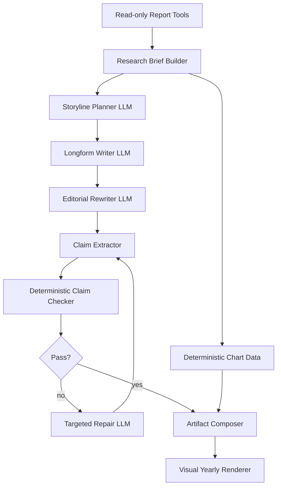

# AI Yearly Report Editorial Agent Pipeline Design

> 创建日期：2026-07-04
> 状态：设计稿，待人工确认后进入 implementation plan
> 相关模块：`backend/domains/ai_reports/`、`backend/services/ai_task_service.py`、`backend/services/yearly_report_agent_service.py`、`backend/providers/llm/`、`frontend/src/features/ai-insights/yearly-artifact/`
> 设计目标：把 AI 年度报告从“确定性数据拼装 + 风格门禁”升级为“研究简报 + LLM 主笔 + LLM 编辑 + 程序事实校验”的文章生产链路。

## 1. 背景

AI 年度报告已经经历了几轮升级：

1. `agentic_longform` 引入只读 Report Agent，让年度报告可以主动查询播放分析、个人 Billboard、流派、高光日和发现回归。
2. `visual_yearly_artifact` 把年度报告从纯 Markdown 升级为结构化图文 artifact，图表数据由后端确定性生成。
3. `yearly_editorial_v1` 增加了 Story Insight Builder、Editorial Plan、语言预算、章节职责和 visual critic。

这些改动解决了很多工程问题：事实更安全、图表能展示、个人 Billboard 能进入报告、刷新链路可观察、报告不会轻易编造生活事件。但用户侧仍然认为报告质量“没有实质进步”。最新 2026 报告虽然技术上通过 probe，却仍然有这些问题：

- 文本像规则生成的分析说明，而不是一篇自然文章。
- 过度使用“证据、画像、结构、尺度、重心”等抽象词。
- 为了避免幻觉，文风过度保守，缺少陪伴感和生活质感。
- 章节有数据点，但缺少真正的年度主题和叙事推进。
- 结尾经常解释“报告应该怎么读”，而不是自然收束。
- 质量门禁主要检查事实和结构，不足以判断“这篇东西好不好读”。

核心判断：当前瓶颈不在模型智力，也不在再补一个规则，而在生成范式。现在的“作者”仍然是确定性 composer；LLM 或 critic 更多是在保障合规。要产生明显质量提升，必须让 LLM 真正承担写作者和编辑角色，同时让程序继续掌握事实、图表和安全边界。

## 2. 产品定位

AI 年度报告应该是一篇写给用户本人的音乐年记。

它不是播放分析页面的摘要，也不是榜单字段的自然语言版。它应该回答：

- 这一年你的音乐生活最像什么故事？
- 哪些声音只是热闹一阵，哪些真的留下来了？
- 播放量和个人 Billboard 是互相印证，还是给出了不同答案？
- 哪些月份、专辑、艺人或高光日改变了这一年的结构？
- 这些数据共同说明你如何使用音乐，而不只是你听了什么？

报告的理想感受是：用户读完后觉得“它确实看懂了我的数据”，同时没有被编造现实生活事件。

## 3. 非目标

本 spec 不做：

- 不开放任意 SQL、任意 URL 或写操作。
- 不访问外部官方 Billboard。
- 不让 LLM 生成图表数据。
- 不重做 AI Insights 前端视觉框架。
- 不引入 PDF、长图、海报或分享导出。
- 不把年报写成无证据散文。
- 不删除现有 `visual_yearly_artifact`，而是在其上替换正文生产链路。

## 4. 设计原则

1. **事实由程序掌握，文章由 LLM 写。**
   后端负责查数据、建 evidence ledger、生成图表和校验事实；LLM 负责主题判断、正文写作和编辑改稿。

2. **先研究，再写作。**
   LLM 不应该直接拿一大包年度数据开写。它应先看到一份研究简报，里面有候选故事、证据、冲突、边界和不能写的内容。

3. **先定主题，再定结构。**
   章节结构不应固定为 opening/main_artist/turning_point/album/highlight/discovery/closing。不同年份应根据数据动态选择结构。

4. **编辑是独立阶段。**
   写作 draft 不是最终答案。必须有 editor pass 专门删废话、降术语、合并重复、强化开头结尾。

5. **校验发生在写作之后。**
   事实安全不能靠 prompt 自觉。最终正文必须抽取 claim，并与 evidence ledger 对齐；失败时局部修复。

6. **可读性门禁和事实门禁分离。**
   事实正确不等于报告好。质量结果要分别记录 `fact_check`、`editorial_review` 和 `taste_rubric`。

## 5. 总体架构

新增 `yearly_editorial_agent_v1` 内部写作 pipeline。前端仍优先渲染 `visual_yearly_artifact` 形态；后端 artifact 增加 `writer_pipeline_version`，并让缓存 key 纳入该版本。



### 5.1 Compatibility

推荐保持外部 report mode：

```json
{
  "report_mode": "visual_yearly_artifact",
  "contract_version": "visual_yearly_v1",
  "writer_pipeline_version": "yearly_editorial_agent_v1"
}
```

原因：

- 前端 artifact 渲染器可以继续复用。
- 旧图表、洞察卡和进度 UI 不需要重做。
- 缓存可以通过 `writer_pipeline_version` 区分旧 deterministic composer 和新 editorial agent。

若后续 artifact shape 发生不兼容变化，再升级 `contract_version` 到 `visual_yearly_v2`。

## 6. Pipeline 设计

### 6.1 Research Brief Builder

`Research Brief` 是写作材料，不是文章。

新增模块：

```text
backend/domains/ai_reports/editorial_agent/research_brief.py
```

职责：

- 调用现有只读年度数据、个人 Billboard、图表数据 builder。
- 把原始数据压缩成“可写作故事材料”。
- 标记每条事实的来源、置信度、可解释轴和禁止推断。
- 生成候选故事，而不是固定章节。

建议结构：

```json
{
  "period": {
    "year": 2026,
    "start_date": "2026-01-01",
    "end_date": "2026-06-23",
    "is_partial_year": true
  },
  "evidence_ledger": [
    {
      "id": "top_artist_taylor_2026",
      "claim": "Taylor Swift 以 1115 次播放位列 2026 当前艺人第一。",
      "source": "yearly_top_entities.artists[0]",
      "kind": "playback_rank",
      "confidence": "high"
    }
  ],
  "story_candidates": [
    {
      "id": "stable_center_and_second_thread",
      "title": "稳定中心之外，第二条声音在 5 月变亮",
      "why_it_matters": "它能避免只写累计排名，而解释阶段变化。",
      "evidence_refs": [
        "top_artist_taylor_2026",
        "artist_monthly_olivia_may"
      ],
      "risk_notes": [
        "不能写成 Olivia Rodrigo 取代 Taylor Swift，除非全年累计证据支持。"
      ]
    }
  ],
  "tensions": [
    {
      "id": "playback_vs_billboard_album_alignment",
      "summary": "播放量和个人 Billboard 专辑榜指向同一张专辑。",
      "evidence_refs": ["top_album_showgirl", "billboard_album_showgirl"]
    }
  ],
  "forbidden_inferences": [
    "不能编造通勤、考试、失眠、分手、天气或地点。",
    "不能把个人 Billboard 写成外部官方 Billboard。"
  ]
}
```

Research Brief 要尽量包含“故事动作”：

- 稳定：长期位居第一、反复回访。
- 转折：某个月突然上升、反超或新增。
- 对齐：播放量和个人 Billboard 指向同一对象。
- 分歧：播放量高但榜单留存弱，或榜单稳定但播放量不最高。
- 密度：某一天播放异常密集。
- 新发现：某个名字首次出现后持续留下。

### 6.2 Storyline Planner LLM

新增模块：

```text
backend/domains/ai_reports/editorial_agent/storyline_planner.py
```

输入：Research Brief、Project Context Prompt、年度报告写作哲学。

输出：结构化 `StorylinePlan`，不是正文。

```json
{
  "thesis": "2026 上半年不是单纯少听或多听，而是 Taylor Swift 的稳定回访、Olivia Rodrigo 的阶段升温和 The Life of a Showgirl 的长留共同构成了音乐重心。",
  "title": "一份还在展开的音乐年记",
  "subtitle": "截至 2026-06-23，稳定、转折和新发现同时存在。",
  "section_plan": [
    {
      "id": "opening",
      "heading": "今年还没有结束，但重心已经出现",
      "purpose": "建立阶段性年报边界和主论点",
      "evidence_refs": ["period_2026_ytd", "activity_density"],
      "tone": "warm_clear"
    }
  ],
  "must_not_write": [
    "不要按 TOP 艺人、TOP 单曲、TOP 专辑固定模块展开。",
    "不要写商业报告词。"
  ]
}
```

Planner 必须选择 4-7 个章节。章节数量不固定，结构由当年数据决定。

Planner 被允许放弃某些数据：不是所有图表都必须进正文。未进入正文的图表仍可显示在 artifact 中，但正文不需要逐一解释。

### 6.3 Longform Writer LLM

新增模块：

```text
backend/domains/ai_reports/editorial_agent/writer.py
```

Writer 只负责写 draft。

输入：

- `ResearchBrief`
- `StorylinePlan`
- `chart_bridge_notes`
- style instruction

输出：

```json
{
  "title": "...",
  "subtitle": "...",
  "sections": [
    {
      "id": "opening",
      "heading": "...",
      "prose": "...",
      "claim_refs": ["period_2026_ytd", "activity_density"],
      "chart_refs": ["listening_calendar"]
    }
  ],
  "closing": "..."
}
```

写作约束：

- 像一篇文章，不像 dashboard note。
- 不要用“依据/自检/限制”这种问答格式。
- 少用“说明、意味着、证据、结构、尺度、画像”。
- 每个章节都要有一个自然段落推进，而不是事实列表。
- 可以写“音乐像日常背景”“某个声音反复回来”“一张专辑在不同周次留下”，但不能编造具体生活事件。
- 个人 Billboard 必须写成“本地个人 Billboard”或“个人 Billboard”，不得写成外部官方 Billboard。

### 6.4 Editorial Rewriter LLM

新增模块：

```text
backend/domains/ai_reports/editorial_agent/editor.py
```

Editor 是本 spec 最关键的新增层。它不查数据，不新增事实，只改稿。

编辑目标：

- 删除重复句和解释性废话。
- 把抽象术语换成更自然的表达。
- 强化首段 thesis。
- 让每节从“报数据”变成“解释这个数据为什么值得记住”。
- 缩短过长结尾。
- 移除“报告应该如何阅读”这种自我说明。
- 保留证据边界，不把谨慎变成幻觉。

Editor 输出必须附带编辑报告：

```json
{
  "revised_article": {...},
  "edit_notes": [
    "删掉了重复的截止日期句。",
    "把 '时间侧证据' 改为更自然的表达。",
    "结尾从 700 字压缩到 180 字。"
  ],
  "risk_flags": []
}
```

如果 editor 发现 draft 本身主题不成立，可以要求 Planner 重新规划一次；最多重试一次。

### 6.5 Claim Extractor and Checker

新增模块：

```text
backend/domains/ai_reports/editorial_agent/claim_checker.py
```

Claim Checker 分两步：

1. 从最终文本抽取声明。
2. 对照 Evidence Ledger 校验。

抽取的声明类型：

- 数字声明：播放次数、小时、活跃日、在榜周数、排名。
- 日期声明：截止日、首次出现日期、高光日、月份。
- 实体声明：艺人、歌曲、专辑名称。
- 关系声明：A 高于 B、播放和榜单对齐、某月反超。
- 口径声明：个人 Billboard、本地 Spotify 数据、年中/全年。

示例：

```json
{
  "claim": "Olivia Rodrigo 在 2026-05 高过 Taylor Swift。",
  "type": "comparison",
  "entities": ["Olivia Rodrigo", "Taylor Swift"],
  "period": "2026-05",
  "matched_evidence_refs": ["artist_monthly_olivia_may"],
  "status": "supported"
}
```

校验结果：

- `supported`：证据支持。
- `unsupported`：没有证据。
- `contradicted`：证据相反。
- `ambiguous`：文本过于模糊，建议改写。
- `scope_leak`：把个人数据写成外部数据。

失败策略：

- 少量 unsupported/ambiguous：Targeted Repair LLM 定点改写。
- 关键 contradicted/scope_leak：阻止缓存，回退到 deterministic artifact 或要求重新生成。
- 修复最多两轮，避免无限循环。

### 6.6 Artifact Composer

Composer 不再负责写主文案，只负责把 LLM 文章和确定性图表合并为 artifact。

它需要：

- 保留 `VisualYearlyArtifact` 前端兼容结构。
- 将 LLM sections 映射到现有 `sections`。
- 将 chart refs 绑定到确定性 `chart_data`。
- insight cards 可继续由 deterministic builder 生成，也可从 StorylinePlan 中提取短句，但数值必须来自 evidence。
- metadata 记录完整 pipeline：

```json
{
  "report_mode": "visual_yearly_artifact",
  "contract_version": "visual_yearly_v1",
  "writer_pipeline_version": "yearly_editorial_agent_v1",
  "research_brief_version": "yearly_research_brief_v1",
  "storyline_planner_model": "...",
  "writer_model": "...",
  "editor_model": "...",
  "claim_check_passed": true,
  "editorial_review_passed": true,
  "fallback_level": null
}
```

## 7. Prompt 设计

### 7.1 Shared System Context

沿用 Project Context Prompt，但新增年度报告写作定位：

- SpotifyStats 是个人音乐数据应用，不是外部市场分析工具。
- Billboard 指本地个人 Billboard。
- 年报应解释“用户如何使用音乐”，而不是复述“页面上有什么数据”。
- 写作必须有陪伴感，但不能编造具体生活事件。

### 7.2 Planner Prompt

目标：选择主题和结构。

必须要求：

- 先提出 2-3 个候选年度主题。
- 选择一个主主题，并解释为什么它比其他主题更适合。
- 动态规划章节，不使用固定模块表。
- 每节列出 evidence refs 和禁止写法。

### 7.3 Writer Prompt

目标：写一篇可读文章。

必须要求：

- 用自然中文。
- 不写“我查了什么/依据/限制”。
- 不写营销报告、咨询报告、产品说明书。
- 事实出现后必须转化为解释。
- 每段都要围绕用户音乐生活，而不是数据系统本身。

### 7.4 Editor Prompt

目标：像编辑一样改稿。

必须要求：

- 删除重复，而不是继续加内容。
- 降低抽象名词密度。
- 保留具体艺人、歌曲、专辑、月份和榜单关系。
- 让结尾更短、更像文章结尾。
- 不新增未在 draft 或 evidence 中出现的事实。

## 8. 质量门禁

### 8.1 Deterministic Gates

必须阻止缓存：

- 事实校验失败。
- 个人 Billboard 口径泄漏。
- 出现无证据生活事件。
- 完整核心事实重复超过 1 次。
- 文本长度过短或过长。
- 没有年度 thesis。
- 没有至少一个播放量 + 个人 Billboard 关系分析。

### 8.2 Editorial Gates

建议 hard blockers：

- `template_structure_detected`：结构退回固定榜单模块。
- `data_listing_without_story`：连续多段只是报数。
- `editorial_jargon_overuse`：抽象词密度过高。
- `weak_opening`：开头没有主题，只报时间和总量。
- `weak_closing`：结尾解释方法论或空泛展望。
- `chart_prose_echo`：正文原样复述图表 observation。

### 8.3 Taste Rubric

新增 `scripts/evaluate_yearly_report_taste.py`，用 rubric 对生成结果评分。它可以先是半自动 JSON 输出，后续再接 LLM-as-judge。

Rubric：

| 维度 | 分值 | 判据 |
|---|---:|---|
| 文章感 | 0-5 | 是否像文章，而不是报告字段说明 |
| 年度主题 | 0-5 | 是否有清楚 thesis |
| 洞见密度 | 0-5 | 是否解释关系，而不只列事实 |
| 个人化 | 0-5 | 是否能看出这是用户自己的音乐数据 |
| 事实安全 | 0-5 | 是否无幻觉、无口径错误 |
| 可读性 | 0-5 | 是否少术语、少重复、段落自然 |
| 图文融合 | 0-5 | 图表和正文是否互相补充 |

上线门槛：

- 总分至少 26/35。
- 事实安全必须 5/5。
- 文章感、年度主题、可读性均不得低于 4/5。

## 9. Task Events and UX

前端 AI task progress 需要展示更接近真实写作流程的阶段：

1. `researching_year`：正在整理年度证据。
2. `planning_storyline`：正在选择年度主题。
3. `drafting_article`：正在撰写年报正文。
4. `editing_article`：正在编辑成稿。
5. `checking_claims`：正在核对事实口径。
6. `assembling_artifact`：正在生成图文年报。
7. `done`：报告生成完成。

用户不需要看到完整 chain-of-thought，但应该能看到“AI 不是空等，也不是只调用一次模型”。

## 10. Fallback Strategy

Fallback 必须诚实标记，不能伪装成正式报告。

建议分层：

| fallback_level | 场景 | 用户展示 |
|---|---|---|
| `none` | editorial agent 全链路成功 | 正式 AI 音乐年报 |
| `repair_used` | claim repair 成功 | 正式年报，可在 metadata 记录 |
| `deterministic_visual_artifact` | LLM 写作失败，但现有 artifact composer 可用 | 标记“基础图文摘要” |
| `research_brief_only` | 图文正文失败，但证据简报可用 | 标记“研究简报” |
| `error` | 数据或任务失败 | 展示错误和重试 |

## 11. Cache and Versioning

缓存 key 必须包含：

- `report_type`
- `year`
- play filter fingerprint
- `report_mode`
- `contract_version`
- `writer_pipeline_version`
- LLM profile id 或模型 fingerprint

原因：同一数据和 artifact shape 下，写作 pipeline 变化会显著改变文本质量，不能被旧缓存挡住。

## 12. Testing and Acceptance

### 12.1 Unit Tests

覆盖：

- Research Brief 从 fixture 中提取 story candidates。
- StorylinePlan schema 校验。
- Editor 不新增 unsupported facts。
- Claim Checker 能识别 supported/unsupported/contradicted/scope_leak。
- Cache key 包含 writer pipeline version。

### 12.2 Contract Tests

覆盖：

- AI task result metadata 包含 `writer_pipeline_version`。
- artifact 仍符合前端 `VisualYearlyArtifact` 形态。
- 失败时 fallback_level 明确。
- claim check 失败不会缓存正式报告。

### 12.3 Golden Year Tests

至少覆盖：

- 2026 年中报告：必须写清 partial year 和 `2026-06-23` 截止日。
- 2025 完整年度：不得使用“下半年观察”这类年中语气。
- 一个播放和个人 Billboard 对齐的年份。
- 一个播放和个人 Billboard 分歧的年份。
- 一个新发现非常强的年份。

### 12.4 Browser Acceptance

真实浏览器 `/ai-insights`：

- 点击“年度叙事”与“刷新报告”。
- 能看到新增进度阶段。
- 报告正文、图表、卡片正常渲染。
- 无横向溢出。
- console error/warn 为 0。
- 刷新后 task id/cached_at 更新。

### 12.5 Human Taste Review

每次大改后人工阅读 2025 和 2026 报告，并按 taste rubric 评分。不能只用 probe pass 作为质量结论。

## 13. Rollout Plan

建议分三步落地：

1. **Research Brief and Claim Checker first**
   先不改默认生成，只构建研究简报和 claim checker，保证事实层可控。

2. **Editorial Agent behind explicit flag**
   增加内部 flag：

   ```json
   {
     "writer_pipeline": "editorial_agent_v1"
   }
   ```

   先通过 probe 和浏览器手动生成，不默认替换用户入口。

3. **Make it default after taste gate**
   只有当 2025/2026 人工口味验收达到门槛，再让年度叙事默认走新 pipeline。

## 14. Risks

### 14.1 成本和延迟上升

新 pipeline 至少需要 Planner、Writer、Editor、Repair 几次 LLM 调用。解决方式：

- 手动生成，不自动触发。
- cache-first。
- 失败时早停。
- 只对年度报告启用，不影响问答和普通报告。

### 14.2 LLM 文风漂移

解决方式：

- 用 style guide 和 editor rubric 限制。
- claim checker 不允许新增事实。
- taste rubric 把“商业报告腔”和“无证据散文”都视为失败。

### 14.3 过度依赖 LLM judge

解决方式：

- 首版 taste rubric 可半自动 + 人工阅读。
- 确定性 gates 仍负责事实、安全、重复和口径。
- LLM-as-judge 只作为辅助，不作为唯一发布门禁。

## 15. Success Criteria

这个设计成功的判断不是“probe 是否通过”，而是：

- 用户能明显感觉报告不像播放分析页面复述。
- 报告有一个清楚年度主题。
- 正文能自然融合播放量和个人 Billboard。
- 至少有 2-3 个段落提供页面上没有直接给出的解释。
- 没有编造具体生活事件。
- 抽象术语明显减少。
- 2025 和 2026 报告读起来有不同结构和不同主线。

## 16. Design Decision Summary

推荐采用 **Hybrid Editorial Agent**：

- 研究和校验确定性。
- 主题、写作和编辑交给 LLM。
- artifact 前端形态保持兼容。
- 缓存用 `writer_pipeline_version` 隔离。
- 质量验收从“事实合规”升级为“事实合规 + 文章口味”。

不推荐继续在 deterministic composer 上增加更多规则。那条路线会继续提升安全性，但很难带来用户感知上的报告质量跃迁。
